# AI-Enabled HR Recruitment and Onboarding Automation Platform

> Document control: Title: README | Version: 1.1 | Owner: [TENANT_CONFIGURATION_REQUIRED] | Status: Draft | Last reviewed: 2026-09-08 | Next review: [TENANT_CONFIGURATION_REQUIRED] | Reviewers: [TENANT_CONFIGURATION_REQUIRED — Product, Architecture, Security, HR, Legal]

## Table of contents

1. [Product overview](#product-overview)
2. [Business problem and goals](#business-problem-and-goals)
3. [Scope and out-of-scope](#scope-and-out-of-scope)
4. [End-to-end workflow summary](#end-to-end-workflow-summary)
5. [Architecture summary](#architecture-summary)
6. [Solution structure](#solution-structure)
7. [Current implementation status](#current-implementation-status)
8. [Local development](#local-development)
9. [Documentation navigation](#documentation-navigation)
10. [Security and AI governance statement](#security-and-ai-governance-statement)
11. [Configurable components](#configurable-components-overview)
12. [Assumptions and pending decisions](#assumptions-and-pending-decisions)

## Product overview

This repository contains both the governance/documentation package **and** a real, working implementation for a platform that automates HR recruitment and onboarding — from a CV landing in a Master CV Bank through to a new hire receiving an Employee ID and downstream systems (HRMS, payroll, IT, access, induction) being triggered. AI performs extraction, matching, drafting, and routing; humans make every decision that materially affects a candidate's or employee's status. Application code exists and runs today for a first slice of the workflow (CV ingestion, TAN creation and approval); the rest of the journey described below is still target-state — see [Current implementation status](#current-implementation-status) and [PROJECT_STATUS.md](PROJECT_STATUS.md) for exactly what's built versus planned.

## Business problem and goals

Recruitment-to-onboarding today is manual, slow, and inconsistent: CVs are scattered, JD-to-candidate matching is subjective, interview loops lose feedback, offer and Green Form data collection is paper-heavy, and discrepancy handling is ad hoc. Goals:

- Reduce time-to-shortlist and time-to-offer through AI-assisted matching and drafting.
- Make every state transition deterministic, auditable, and reversible via approval.
- Ensure candidate data and documents are handled securely and fairly across tenants.
- Make the platform configurable per tenant/business unit/location/grade without code changes.

## Scope and out-of-scope

**In scope:** CV ingestion and CV Bank, TAN creation against a JD, AI-assisted candidate matching, interview scheduling and feedback capture (L1/L2/client), offer generation and acceptance, Green Form issuance, document collection and verification, discrepancy management, employee conversion and Employee ID issuance, downstream integration triggers.

**Out of scope (this phase):** production infrastructure provisioning, final vendor selection, compensation-band decisioning logic, legal employment-contract content, any autonomous AI decisioning on hiring outcomes. See [docs/00-product/scope-assumptions-open-questions.md](docs/00-product/scope-assumptions-open-questions.md).

## End-to-end workflow summary

```mermaid
flowchart LR
    A[CV Upload] --> B[Parse / Normalize / Dedupe]
    B --> C[Master CV Bank]
    D[Create TAN + JD] --> E[TAN Approval]
    E --> F[AI Candidate Matching]
    F --> G[HR/Hiring Manager Review]
    G -->|Approve| H[Shortlist]
    H --> I[L1 Interview]
    I -->|Reject| J[Close for this TAN + Recommend Alternates]
    I -->|Select| K[L2 Interview]
    K -->|Select, if required| L[Client Interview]
    L --> M[Final Selection Approval]
    M --> N[Offer Generation + Approval]
    N --> O[Offer Sent]
    O --> P[Candidate Acceptance]
    P --> Q[Green Form Issued]
    Q --> R[Docs + History Collected]
    R --> S[Verification]
    S -->|Discrepancy| T[Discrepancy Report]
    T --> U[Re-upload / Clarification]
    U --> V[HR Approval to Close]
    S -->|Clean| W[Employee Conversion Gate]
    V --> W
    W --> X[Employee ID Created]
    X --> Y[Downstream Integrations: HRMS / Payroll / IT / Access / Induction]
```



Full detail: [docs/02-business-workflows/end-to-end-recruitment-onboarding-workflow.md](docs/02-business-workflows/end-to-end-recruitment-onboarding-workflow.md) and [workflow-state-machine.md](docs/02-business-workflows/workflow-state-machine.md).

## Architecture summary

API-first, modular, event-driven. Relational database is the system of record; object storage holds documents; a vector store holds only approved retrieval content for RAG. See [docs/01-architecture/solution-architecture.md](docs/01-architecture/solution-architecture.md) and the [technology-selection-matrix](docs/01-architecture/technology-selection-matrix.md) for the configurable default stack (React/Next.js, ASP.NET Core, Python agent service, PostgreSQL/SQL Server, Redis, Blob/S3, pgvector/Azure AI Search/Qdrant/Pinecone/Weaviate, Entra ID/OIDC, API gateway, Service Bus/RabbitMQ/Kafka, OpenTelemetry, Docker/Kubernetes, Terraform/Bicep/Pulumi, GitHub Actions/Azure DevOps/GitLab CI).

## Solution structure

```
src/
├── HrAutomation.Domain          # Core domain entities/enums — no dependencies
├── HrAutomation.Application     # Use cases, orchestration, guardrail/approval contracts
├── HrAutomation.Infrastructure  # Persistence, audit, approval-gate implementations
├── HrAutomation.Agents          # Skill implementations (CV ingestion, TAN, matching, ...)
├── HrAutomation.Rag             # Policy/document retrieval skill
├── HrAutomation.Mcp             # MCP tool implementations (calendar, ...)
├── HrAutomation.Api             # ASP.NET Core REST API — the only integration point for the frontend
└── HrAutomation.Web             # React + TypeScript presentation layer
    (HrAutomation.Infrastructure/Database/ holds the hand-written, database-first SQL Server
     DDL/seed data for HrAutomationDb — scripts/, seed/, tests/, docs/ (currently empty), migrations/)

tests/HrAutomation.Tests/        # xUnit integration tests, run against a real HrAutomationDb instance
```

`HrAutomation.Web` is the React presentation layer for recruiters, hiring managers, interviewers, document verifiers, HR admins, and (via a token-based Green Form flow) candidates. Its **only** runtime dependency is `HrAutomation.Api`'s versioned REST contract (`/api/v1/...`) — it never accesses a database directly and never references `HrAutomation.Domain`, `.Application`, `.Infrastructure`, `.Agents`, `.Rag`, or `.Mcp`. All business rules, workflow-transition validation, authorization, and audit logging remain server-side; the UI guides users and validates basic input, but is never the final authority on a business decision. See [src/HrAutomation.Web/README.md](src/HrAutomation.Web/README.md) and [docs/01-architecture/frontend-architecture.md](docs/01-architecture/frontend-architecture.md). **Current caveat:** the frontend runs today only against an in-browser mock API (MSW) with mock sign-in — it has not yet been wired to call the real `HrAutomation.Api` (no real auth provider exists yet; `oidcAuthProvider.ts` is an intentional stub).

## Current implementation status

Summary only — see [PROJECT_STATUS.md](PROJECT_STATUS.md) for the authoritative, maintained breakdown.

- **Implemented and verified end-to-end** (real HTTP calls against the real API and the real `HrAutomationDb` database, **including from the actual React UI with MSW disabled** — see [docs/09-quality-evaluation/live-sql-server-integration-verification.md](docs/09-quality-evaluation/live-sql-server-integration-verification.md)): CV upload/parsing into the Master CV Bank; TAN creation, auto-submission for approval, and approval/rejection; candidate/TAN list and read endpoints; audit log listing.
- **Scaffolded, not implemented**: candidate matching, shortlist approval, interview scheduling/feedback, offer drafting/approval/send/acceptance, Green Form issuance, document verification, discrepancy management, employee conversion — each has a registered skill that always returns "blocked, not yet implemented," and/or a frontend page showing mock data only.
- **Not present**: RAG retrieval pipeline (`HrAutomation.Rag` is an empty scaffold), MCP tool servers (`HrAutomation.Mcp` is an empty scaffold), any downstream integration (HRMS/payroll/calendar/email/e-signature/background-verification/IT provisioning), production infrastructure.
- The database (`HrAutomationDb`, SQL Server, ~243 tables, database-first) is far more complete than the application code that reads/writes it — most tables exist with no C# code wired to them yet. See [ADR-006](docs/adr/ADR-006-database-first-stored-procedure-workflow.md).

## Local development

```bash
# Backend (from repo root)
dotnet build HrAutomation.slnx
dotnet test tests/HrAutomation.Tests/HrAutomation.Tests.csproj
dotnet run --project src/HrAutomation.Api/HrAutomation.Api.csproj

# Database — deploy HrAutomationDb to a local SQL Server/LocalDB instance by running
# src/HrAutomation.Infrastructure/Database/scripts/00-*.sql through 09-*.sql in order,
# then optionally src/HrAutomation.Infrastructure/Database/seed/01-*.sql through 09-*.sql
# for demo/reference data. Set the connection string via
# `dotnet user-secrets set "ConnectionStrings:HrAutomationDb" "..."` from src/HrAutomation.Api
# — never commit a real connection string or password.

# Frontend (from src/HrAutomation.Web)
npm install
cp .env.example .env.local   # defaults to mock mode — no backend required
npm run dev
```

[TENANT_CONFIGURATION_REQUIRED — docker-compose / containerized local-dependency instructions once `docker-compose.yml` is populated for this stack].

## Documentation navigation

Start at [GENERATED_FILES.md](GENERATED_FILES.md) for the complete file tree, purpose of every file, and recommended reading order. Quick links: [Product](docs/00-product/) · [Workflows](docs/02-business-workflows/) · [Architecture](docs/01-architecture/) · [Data](docs/03-data/) · [API](docs/04-api/) · [Security & Governance](docs/05-security-governance/) · [AI/Agents/RAG](docs/06-ai-agents-rag/) · [MCP](docs/07-mcp-integrations/) · [Operations](docs/08-operations-observability/) · [Quality](docs/09-quality-evaluation/) · [Delivery](docs/10-delivery/).

## Security and AI governance statement

The platform is built zero-trust and configuration-first. AI never autonomously rejects/selects candidates, releases offers, sets compensation, closes discrepancies, or creates Employee IDs — every such action requires an explicit, audited human approval (Section 5 of [CLAUDE.md](CLAUDE.md)). Candidate matching uses only job-relevant, approved criteria and excludes protected characteristics. See [docs/05-security-governance/](docs/05-security-governance/) and [docs/06-ai-agents-rag/ai-guardrails](docs/05-security-governance/ai-guardrails-policy.md).

## Configurable components overview

Tenant branding/roles, TAN and Employee-ID numbering, job grades, workflow stages/transitions, approval matrices, interview stages/SLAs, matching weights, model routing, prompt/skill versions, RAG parameters, document checklists/retention, discrepancy taxonomy, notification templates, integration endpoints (as secret references), feature flags, rate limits/circuit breakers, observability sampling/alerts, retention/deletion rules. All defined under `config/` with JSON Schemas in `config/schemas/`.

## Assumptions and pending decisions

- The relational database is fixed (SQL Server, `HrAutomationDb`) — no longer an open per-tenant choice; see [ADR-006](docs/adr/ADR-006-database-first-stored-procedure-workflow.md). Vector store and messaging bus remain [TENANT_CONFIGURATION_REQUIRED] and unimplemented.
- Legal requirements (data residency, retention periods, right-to-erasure handling, background-check scope) are [LEGAL_REVIEW_REQUIRED].
- Compensation/grade policy content is [TENANT_POLICY_REQUIRED].
- See [docs/00-product/scope-assumptions-open-questions.md](docs/00-product/scope-assumptions-open-questions.md) and [DECISIONS_REQUIRED.md](DECISIONS_REQUIRED.md) for the full register of open decisions.

### Change control

| Version | Date | Author | Change |
|---|---|---|---|
| 1.0 | 2026-09-07 | Documentation package generation | Initial creation |
| 1.1 | 2026-09-08 | Documentation reconciliation pass | Reconciled against real implementation: added Current implementation status, real local-dev commands, corrected "no application code" framing |
