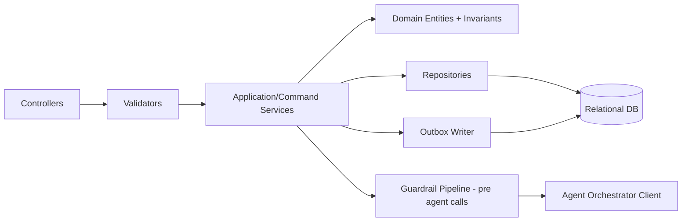

# Component Architecture

> Title: Component Architecture | Version: 1.0 | Owner: [TENANT_CONFIGURATION_REQUIRED — Architecture] | Status: Draft | Last reviewed: 2026-09-07 | Next review: [TENANT_CONFIGURATION_REQUIRED] | Reviewers: Architecture, Engineering leads

## Purpose and scope

Decomposes each bounded context from [solution-architecture.md](solution-architecture.md) into internal components/modules, showing responsibilities and internal interfaces. Informative for implementation planning; not a source-code specification.

## HR Core API — internal modules

| Module | Responsibility |
|---|---|
| Controllers | REST endpoint surface, request/response mapping, auth context extraction |
| Validators | Schema + business-rule validation (fail closed) |
| Application/Command Services | Orchestrate a single use case; enforce approval-matrix checks before state mutation |
| Domain Entities | Encapsulate invariants (e.g., a TAN cannot be approved twice) |
| Repositories | Persistence abstraction over the relational store |
| Outbox Writer | Writes domain events to the outbox table in the same transaction as state change |
| Guardrail Pipeline | Input/output filtering before/after any agent call (see [ai-guardrails-policy.md](../05-security-governance/ai-guardrails-policy.md)) |

## Agent Orchestrator — internal modules

| Module | Responsibility |
|---|---|
| Supervisor Agent | Routes a task to the correct specialist skill; enforces skill allow-list per task type |
| Specialist Skills | CV extraction, candidate matching, offer drafting, verification assistance, interview-coordination drafting (see [agent-skill-catalog.md](../06-ai-agents-rag/agent-skill-catalog.md)) |
| Tool Gateway | Mediates all MCP tool calls; enforces scopes, timeouts, retries, circuit breakers |
| Output Validator | Validates skill outputs against JSON Schema before returning to HR Core API |
| Guardrail Hooks | Prompt-injection detection, PII redaction, confidence thresholding |
| Session/Run State Store | Ephemeral run state only — never the workflow system of record |

## Document Service — internal modules

| Module | Responsibility |
|---|---|
| Upload Handler | Virus/malware scan, content-type validation, size limits (see [secure-file-upload-policy.md](../05-security-governance/secure-file-upload-policy.md)) |
| Storage Adapter | Object storage abstraction (Blob/S3/GCS) |
| Metadata Indexer | Persists document metadata, classification, retention tag |
| Extraction Trigger | Emits event to Agent Plane for CV parsing |

## Integration Adapters — internal modules

| Module | Responsibility |
|---|---|
| Outbox Relay | Polls/streams outbox, publishes to message bus |
| Adapter per external system | Translates canonical event to external API call via the relevant MCP server |
| Inbox/Idempotency Store | De-duplicates inbound callbacks (e.g., e-signature webhook) |
| Dead-Letter Handler | Routes permanently failed deliveries to DLQ + alert |

## Assumptions and dependencies

Internal module boundaries assume a modular monolith or a small set of services per bounded context, not a large microservice fleet — see [technology-selection-matrix.md](technology-selection-matrix.md) selection criteria. Final service granularity is [TENANT_CONFIGURATION_REQUIRED]/architecture-review pending.

## Risks and open questions

- Whether Reporting Service should be a component of HR Core or fully separate — pending scale/ownership decision.

## Change control

| Version | Date | Author | Change |
|---|---|---|---|
| 1.0 | 2026-09-07 | Documentation package generation | Initial creation |
