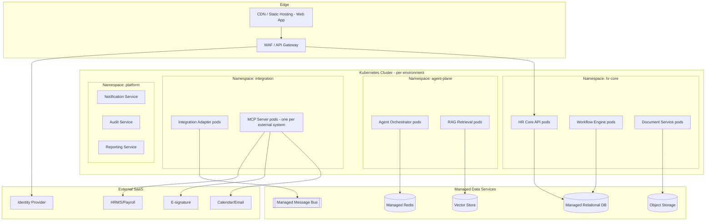

# Deployment Architecture

> Title: Deployment Architecture | Version: 1.0 | Owner: [TENANT_CONFIGURATION_REQUIRED — Platform/DevOps] | Status: Draft | Last reviewed: 2026-09-07 | Next review: [TENANT_CONFIGURATION_REQUIRED] | Reviewers: Architecture, Security, DevOps

## Purpose and scope

Describes the default runtime deployment topology: containerized services on Kubernetes, cloud-provider-agnostic, with environment promotion dev → test → staging → prod. See [environment-strategy.md](../10-delivery/environment-strategy.md) for environment-specific config and [ci-cd-quality-gates.md](../10-delivery/ci-cd-quality-gates.md) for promotion gates.

## Deployment diagram

## Environment topology

| Environment | Purpose | Data | Scale |
|---|---|---|---|
| dev | Developer integration | Synthetic/fake only | Minimal, single replica |
| test | Automated test execution (CI) | Synthetic, reset per run | Ephemeral |
| staging | Pre-prod validation, UAT | De-identified or synthetic | Prod-like, reduced scale |
| prod | Live tenant traffic | Real (protected per [data-classification-and-retention.md](../03-data/data-classification-and-retention.md)) | Full, autoscaled |

## Deployment principles

- Immutable container images, promoted (not rebuilt) between environments.
- Each MCP server deployed as an isolated workload with its own credentials and network policy (see [ADR-004](../adr/ADR-004-mcp-security-model.md)).
- Blue/green or canary rollout for the HR Core API and Workflow Engine; feature flags gate new workflow stages.
- Secrets injected at runtime from a vault — never baked into images (see [secrets-and-key-management.md](../05-security-governance/secrets-and-key-management.md)).
- Network policy: default-deny between namespaces; explicit allow rules per integration.

## RTO/RPO targets (configurable defaults — [TENANT_CONFIGURATION_REQUIRED])

| Tier | RTO | RPO |
|---|---|---|
| HR Core API / Workflow Engine / RDBMS | 4 hours | 15 minutes |
| Document Service / Object Storage | 8 hours | 1 hour |
| Vector Store (rebuildable from source docs) | 24 hours | N/A (derived data) |
| Reporting/Analytics | 24 hours | 24 hours |

See [resilience-and-disaster-recovery.md](resilience-and-disaster-recovery.md) for full DR strategy.

## Infrastructure as Code

Default: Terraform (alternatives: Bicep, Pulumi — see [technology-selection-matrix.md](technology-selection-matrix.md)). All environments provisioned from the same IaC modules with environment-specific variable files; no manual console changes to prod.

## Assumptions and dependencies

Cloud provider is [TENANT_CONFIGURATION_REQUIRED]. Kubernetes distribution (managed AKS/EKS/GKE vs. self-managed) is [TENANT_CONFIGURATION_REQUIRED].

## Risks and open questions

- Multi-region active/active vs. active/passive — pending business continuity requirements [LEGAL_REVIEW_REQUIRED] for data residency.

## Change control

| Version | Date | Author | Change |
|---|---|---|---|
| 1.0 | 2026-09-07 | Documentation package generation | Initial creation |
