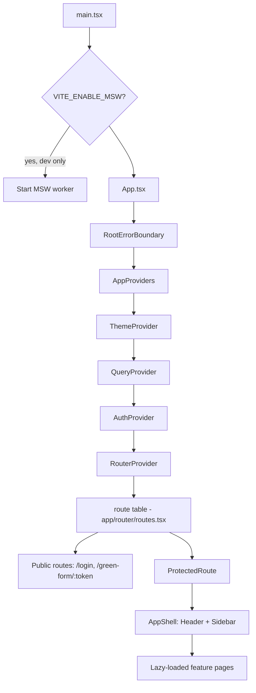

# Frontend Architecture

> Title: Frontend Architecture | Version: 1.0 | Owner: [TENANT_CONFIGURATION_REQUIRED — Frontend Engineering] | Status: Draft | Last reviewed: 2026-09-08 | Next review: [TENANT_CONFIGURATION_REQUIRED] | Reviewers: Architecture, Security, Frontend Engineering

## Table of contents

1. [Purpose and scope](#purpose-and-scope)
2. [Architecture boundary](#architecture-boundary)
3. [Technology stack](#technology-stack)
4. [Application shell](#application-shell)
5. [Feature-first folder structure](#feature-first-folder-structure)
6. [Routing and lazy loading](#routing-and-lazy-loading)
7. [State management](#state-management)
8. [Design tokens](#design-tokens)
9. [Assumptions and dependencies](#assumptions-and-dependencies)
10. [Risks and open questions](#risks-and-open-questions)
11. [Change control](#change-control)

## Purpose and scope

Describes the architecture of `src/HrAutomation.Web`, the React/TypeScript presentation layer for the platform. Covers structure and patterns only — see [docs/04-api/frontend-api-integration.md](../04-api/frontend-api-integration.md) for the API contract relationship and [docs/05-security-governance/frontend-security.md](../05-security-governance/frontend-security.md) for security controls.

## Architecture boundary

`HrAutomation.Web` is presentation only:

- It calls `HrAutomation.Api`'s versioned REST endpoints (`/api/v1/...`) exclusively — no database access, no reference to `HrAutomation.Domain`, `.Application`, `.Infrastructure`, `.Agents`, `.Rag`, or `.Mcp`.
- All business rules, workflow-transition validation, authorization, approval enforcement, audit logging, and tenant isolation are enforced server-side. Route guards (`ProtectedRoute`, `PermissionRoute`) and `usePermissions()` checks shape the UI experience only — they are never the authorization boundary. See [ADR-002](../adr/ADR-002-agent-orchestration-pattern.md) for the analogous "agents propose, backend decides" principle this frontend boundary mirrors.
- Sensitive workflow actions (shortlist approval, offer send, discrepancy resolution, employee conversion) are always confirmed explicitly in the UI (`components/common/ConfirmActionDialog.tsx`) and always resolved by a backend endpoint that independently enforces the approval matrix ([human-approval-matrix.md](../02-business-workflows/human-approval-matrix.md)).
- AI-generated content is always rendered inside `components/common/AiRecommendationPanel.tsx`, labeled "AI recommendation — human approval required" — never presented as a final decision, per [ai-guardrails-policy.md](../05-security-governance/ai-guardrails-policy.md).

## Technology stack

| Concern | Choice | Notes |
|---|---|---|
| Framework | React 19 + TypeScript (strict) | |
| Build tool | Vite | Dev server proxies `/api/*` — see [frontend-api-integration.md](../04-api/frontend-api-integration.md) |
| Routing | React Router v7 (data router) | Navigation updates wrap in `React.startTransition` unconditionally as of v7 (previously the opt-in `future.v7_startTransition` flag on v6) — see `app/providers/RouterProvider.tsx` |
| Server state | TanStack Query | See [State management](#state-management) |
| Forms | React Hook Form + Zod | Client-side validation is a UX convenience, never authoritative |
| HTTP client | Axios, wrapped in `api/client/apiClient.ts` | Single chokepoint — see [frontend-api-integration.md](../04-api/frontend-api-integration.md) |
| Styling | Tailwind CSS + hand-rolled primitives (`components/ui/`) | No heavy component-library dependency; primitives follow shadcn/ui conventions |
| Icons | lucide-react | |
| Testing | Vitest, React Testing Library, MSW, Playwright, axe-core | See [frontend-test-strategy.md](../09-quality-evaluation/frontend-test-strategy.md) |

## Application shell



Provider order is deliberate: `ThemeProvider` has no dependencies; `QueryProvider` must wrap anything using TanStack Query; `AuthProvider` must wrap the router since route guards read auth state; `RouterProvider` is innermost. The router instance is injectable (`AppProvidersProps.router`) so tests can substitute `createMemoryRouter` for the real `createBrowserRouter` — see [frontend-test-strategy.md](../09-quality-evaluation/frontend-test-strategy.md) for why.

## Feature-first folder structure

Each business area owns a folder under `src/features/` containing its pages and (where needed) its TanStack Query hooks, keeping areas independent and lazy-loadable:

```
src/features/<area>/
├── <Area>ListPage.tsx
├── <Area>DetailPage.tsx
└── use<Area>.ts        # TanStack Query hooks for this area only
```

Shared, cross-feature building blocks live in `src/components/` (ui primitives, common app components, form helpers) and `src/hooks/` (auth, permissions, feature flags, debounce) — never duplicated per feature.

## Routing and lazy loading

`app/router/routes.tsx` is the single route table, built from `routeObjects` (a plain `RouteObject[]`) so both the production `createBrowserRouter` and test-only `createMemoryRouter` can consume it identically. Every feature page is behind `React.lazy()` + `Suspense`, so each route ships its own JS chunk (verified in the production build output). Route guarding is layered:

1. `ProtectedRoute` — redirects to `/login` if unauthenticated.
2. `PermissionRoute` — redirects to `/access-denied` if the authenticated role lacks the route's required permission.
3. Candidate-facing routes (`/green-form/:token`, `/green-form/submission/:submissionId`) are deliberately outside both guards — there is no internal session for an external candidate.

## State management

- **Server state**: TanStack Query only, with query keys grouped by domain (`lib/constants.ts` `QUERY_KEYS`). Mutations never auto-retry; queries retry only network/server errors (`api/client/apiError.ts` `isRetryableError`).
- **Auth state**: isolated in `features/auth/AuthContext.tsx`, read via `hooks/useAuth.ts` — never duplicated into another store.
- **Global client state**: minimal by design — theme preference (`ThemeProvider`) is the only cross-cutting client state outside forms/query cache.
- **Optimistic updates**: only for low-risk, reversible user-preference interactions (e.g., column visibility in `DataTable`) — never for approval, rejection, offer sending, discrepancy closure, or employee conversion, which always wait for the confirmed server response.

## Design tokens

Tailwind's CSS-first config (a `@theme` block in `src/styles/globals.css`, as of Tailwind v4 — there is no `tailwind.config.js` anymore) defines the neutral, accessible color palette (`brand`, `status.*`); `src/styles/theme.css` mirrors the spacing/radius/shadow tokens as CSS custom properties for any future non-Tailwind consumer. Status is always communicated via icon + label + color together (`components/common/StatusBadge.tsx`) — never color alone.

## Assumptions and dependencies

Assumes `HrAutomation.Api` is the only backend; a BFF layer, if adopted later for cookie-based auth (see [frontend-security.md](../05-security-governance/frontend-security.md)), would sit in front of it without changing this architecture's shape.

## Risks and open questions

- Whether a heavier component library (e.g., a full shadcn/ui CLI install with Radix primitives) replaces the current hand-rolled `components/ui/` primitives as the design system matures — [TENANT_CONFIGURATION_REQUIRED].
- Localization/i18n strategy is not yet implemented (only timezone configuration exists) — [TENANT_CONFIGURATION_REQUIRED].

## Change control

| Version | Date | Author | Change |
|---|---|---|---|
| 1.0 | 2026-09-08 | HrAutomation.Web scaffold generation | Initial creation |
| 1.1 | 2026-09-09 | Platform upgrade — Phase 3 (Claude Code) | Updated stack table (React 18→19, React Router v6→v7) and Design tokens section (Tailwind v3 `tailwind.config.js` → v4 CSS-first `@theme` config) to match the real implementation after the platform upgrade; see [platform-upgrade-gap-analysis.md](../09-quality-evaluation/platform-upgrade-gap-analysis.md) |
