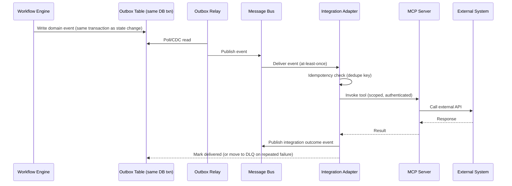

# Integration Architecture

> Title: Integration Architecture | Version: 1.0 | Owner: [TENANT_CONFIGURATION_REQUIRED — Architecture] | Status: Draft | Last reviewed: 2026-09-07 | Next review: [TENANT_CONFIGURATION_REQUIRED] | Reviewers: Architecture, Integration Engineering, Security

## Purpose and scope

Defines how the platform integrates with external systems (calendar, email, HRMS, e-signature, payroll, IT provisioning, background verification) via event-driven patterns and MCP servers, and how reliability is achieved. See [mcp-architecture.md](../07-mcp-integrations/mcp-architecture.md) for MCP-specific detail.

## Integration pattern

## Reliability patterns

| Pattern | Applied where | Detail |
|---|---|---|
| Transactional outbox | Every state change that must notify other services | Event written in same DB transaction as state mutation — see [ADR-001](../adr/ADR-001-transactional-system-of-record.md) |
| Idempotency | All command endpoints and event consumers | `Idempotency-Key` header (API) / dedupe key (events) — see [api-standards.md](../04-api/api-standards.md) |
| Optimistic concurrency | All mutable entities | Version/ETag field checked on update; `409 Conflict` on mismatch |
| Retry with backoff | All external calls via MCP | Configurable max attempts, exponential backoff + jitter |
| Circuit breaker | Per external system adapter | Opens after configurable consecutive-failure threshold; half-open probe |
| Dead-letter queue | Message bus consumers | Failed-after-retries messages routed to DLQ + alert, replayable |
| Replay | DLQ and outbox | Manual or automated replay tooling after root cause fixed |

## Integration catalog

| System | Direction | Pattern | Adapter/MCP server |
|---|---|---|---|
| Calendar | Outbound (create/update invite), Inbound (availability) | Sync (availability query) + async (invite events) | `mcp-calendar` |
| Email | Outbound | Async | `mcp-email` |
| HRMS | Outbound (employee creation), Inbound (org/comp reference data) | Async (creation), sync (reference lookups, cached) | `mcp-hrms` |
| E-signature | Outbound (send for signature), Inbound (webhook callback) | Async | `mcp-esignature` |
| Payroll | Outbound (new hire feed) | Async | `mcp-payroll` |
| IT Provisioning | Outbound (account/access request) | Async | `mcp-it-provisioning` |
| Background Verification | Outbound (initiate check), Inbound (result) | Async | `mcp-background-verification` |
| Document Management (if external DMS used) | Bidirectional | Async | `mcp-document-management` |

## Assumptions and dependencies

Specific vendor APIs behind each MCP server are tenant-configurable (see `config/tenants/sample-tenant.yaml`); this document defines the pattern, not the vendor contract.

## Risks and open questions

- Some legacy HRMS targets may only support batch file exchange rather than real-time APIs — fallback pattern (SFTP batch adapter) may be needed: [TENANT_CONFIGURATION_REQUIRED].

## Change control

| Version | Date | Author | Change |
|---|---|---|---|
| 1.0 | 2026-09-07 | Documentation package generation | Initial creation |
