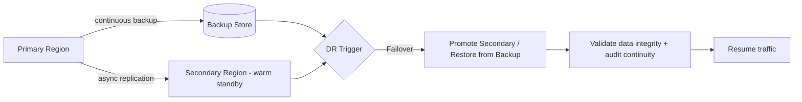

# Resilience and Disaster Recovery

> Title: Resilience and Disaster Recovery | Version: 1.0 | Owner: [TENANT_CONFIGURATION_REQUIRED — Architecture/DevOps] | Status: Draft | Last reviewed: 2026-09-07 | Next review: [TENANT_CONFIGURATION_REQUIRED] | Reviewers: Architecture, DevOps, Security

## Purpose and scope

Defines resilience patterns for transient failures and disaster-recovery strategy for larger outages. Complements [deployment-architecture.md](deployment-architecture.md) (RTO/RPO targets) and [integration-architecture.md](integration-architecture.md) (retry/circuit-breaker/DLQ patterns).

## Resilience patterns in force

| Pattern | Scope | Configuration key |
|---|---|---|
| Idempotency keys | All command APIs, all event consumers | `resilience.idempotency.*` |
| Optimistic concurrency (ETag/version) | All mutable entities | `resilience.concurrency.*` |
| Retry with exponential backoff + jitter | All external/MCP calls | `resilience.retry.*` |
| Circuit breaker | Per external system adapter | `resilience.circuit_breaker.*` |
| Dead-letter queue + alert | Message bus consumers | `resilience.dlq.*` |
| Bulkhead (resource isolation) | Agent Plane vs. Core API (separate pools) | `resilience.bulkhead.*` |
| Timeout budgets | Every synchronous call, including LLM/tool calls | `resilience.timeouts.*` |
| Graceful degradation | RAG retrieval failure → "no-answer" fallback, not a hard error | `rag.no_answer_fallback` |

Default values live in `config/defaults/platform.default.yaml`; see [platform-config.schema.json](../../config/schemas/platform-config.schema.json).

## Disaster recovery strategy

| Failure scenario | Detection | Response |
|---|---|---|
| Database primary failure | Health checks / managed-DB failover | Automated failover to replica (managed service), validate RPO |
| Full region outage | Multi-region health checks | Manual or automated failover to secondary region per DR runbook |
| Object storage outage | Health checks | Serve cached metadata; block new uploads with clear error; no data loss (durable storage layer) |
| Vector store outage | Health checks | Fall back to "no-answer" RAG mode; core workflow unaffected (vector store is not system of record) |
| Message bus outage | Health checks | Outbox retains events; relay resumes on recovery — no event loss |
| MCP server outage (single integration) | Circuit breaker | Isolated to that integration; workflow continues, manual fallback offered to users |

## Backup and restore

- RDBMS: continuous point-in-time backup, tested restore on a configurable cadence (default: quarterly — [TENANT_CONFIGURATION_REQUIRED]).
- Object storage: versioning + soft-delete retention window (see [data-classification-and-retention.md](../03-data/data-classification-and-retention.md)).
- Vector store: rebuildable from source documents; not independently backed up as a hard requirement.

## Chaos/resilience testing

See [test-strategy.md](../09-quality-evaluation/test-strategy.md) for the chaos/resilience test tier (e.g., inject MCP timeouts, kill outbox relay, simulate DB failover) run in staging on a configurable cadence.

## Assumptions and dependencies

Actual RTO/RPO contractual commitments and DR test cadence are [TENANT_CONFIGURATION_REQUIRED].

## Risks and open questions

- Cross-region data residency constraints may prohibit a warm-standby secondary region in some jurisdictions — [LEGAL_REVIEW_REQUIRED].

## Change control

| Version | Date | Author | Change |
|---|---|---|---|
| 1.0 | 2026-09-07 | Documentation package generation | Initial creation |
