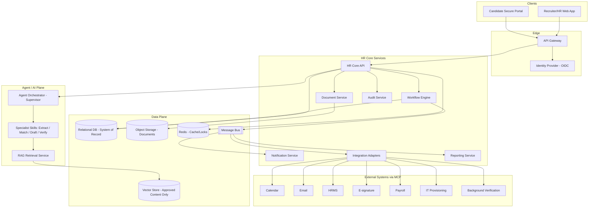

# Solution Architecture

> Title: Solution Architecture | Version: 1.1 | Owner: [TENANT_CONFIGURATION_REQUIRED — Chief/Principal Architect] | Status: Draft (target-state; real implementation is a single monolith, not the bounded-context split below — see notice) | Last reviewed: 2026-09-08 | Next review: [TENANT_CONFIGURATION_REQUIRED] | Reviewers: Architecture, Security, Platform

> **Implementation reality notice (2026-09-08):** the bounded-context breakdown below (separate Workflow Engine, Document Service, Agent Orchestrator, RAG Retrieval Service, Notification Service, Audit Service, Integration Adapters, Reporting Service) is a target-state design; none of these are separately deployed services today. The real implementation is one .NET 8 solution/deployable — `HrAutomation.Domain` / `.Application` / `.Infrastructure` / `.Agents` / `.Api` / `.Rag` / `.Mcp` projects plus the `HrAutomation.Web` React app — backed by one SQL Server database, `HrAutomationDb`. Workflow logic lives inside per-entity stored procedures (`HrAutomation.Infrastructure/Database/scripts/07-create-stored-procedures.sql`), not a standalone Workflow Engine service. `HrAutomation.Rag` and `HrAutomation.Mcp` are empty scaffolds with no working retrieval pipeline or MCP server yet. See [PROJECT_STATUS.md](../../PROJECT_STATUS.md) for the current build-out state and [ADR-006](../adr/ADR-006-database-first-stored-procedure-workflow.md).

## Table of contents

1. [Purpose and scope](#purpose-and-scope)
2. [Architecture principles](#architecture-principles)
3. [Context diagram](#context-diagram)
4. [Bounded contexts / service boundaries](#bounded-contexts--service-boundaries)
5. [Sync vs. async decisions](#sync-vs-async-decisions)
6. [Tenant isolation model](#tenant-isolation-model)
7. [Cross-cutting concerns](#cross-cutting-concerns)
8. [Assumptions and dependencies](#assumptions-and-dependencies)
9. [Risks and open questions](#risks-and-open-questions)
10. [Change control](#change-control)

## Purpose and scope

Defines the target-state solution architecture for the platform: bounded contexts, integration style, and tenant isolation. Technology choices are defaulted in [technology-selection-matrix.md](technology-selection-matrix.md) and fixed only via ADR. See also [component-architecture.md](component-architecture.md) (internal component detail) and [deployment-architecture.md](deployment-architecture.md) (runtime topology).

## Architecture principles

1. API-first: every capability is exposed via a versioned contract before implementation (OpenAPI/AsyncAPI).
2. Modular, event-driven: services communicate synchronously for read/command-validation and asynchronously for state-change propagation.
3. Relational database is the **only** system of record for workflow, approvals, offers, and employee data (see [ADR-001](../adr/ADR-001-transactional-system-of-record.md)).
4. Vector store holds only approved retrieval content, never authoritative state (see [ADR-003](../adr/ADR-003-rag-and-vector-store-boundary.md)).
5. Deterministic state machine outside the LLM; agents propose, the workflow engine decides and commits (see [ADR-002](../adr/ADR-002-agent-orchestration-pattern.md)).
6. All external system access goes through isolated, authenticated MCP servers (see [ADR-004](../adr/ADR-004-mcp-security-model.md)).
7. Every technology is configuration-swappable unless recorded as fixed in an ADR.

## Context diagram

## Bounded contexts / service boundaries

| Context | Responsibility | Owns data | Talks to |
|---|---|---|---|
| Identity & Access | AuthN/AuthZ, RBAC/ABAC | Users, roles, permissions (reference) | API Gateway, all services |
| HR Core API | Command/query surface for candidates, TAN, applications, offers | — (delegates to workflow/domain services) | Workflow Engine, Document Service |
| Workflow Engine | Deterministic state machine, approval enforcement | Workflow state, approval records | HR Core API, Audit Service, Message Bus |
| Document Service | Upload, storage, retrieval of documents/CVs | Document metadata (blob refs) | Object Storage, Agent Plane (extraction) |
| Agent Orchestrator | Supervises specialist skills, enforces least privilege | Agent run/session state (ephemeral) | Skills, RAG, MCP (via Integration Adapters) |
| RAG Retrieval Service | Approved-content retrieval for policy/JD grounding | Vector index (derived, rebuildable) | Vector Store |
| Notification Service | Templated, multi-channel notifications | Notification templates/log | Message Bus, external email/calendar via MCP |
| Audit Service | Immutable audit trail | Audit log | All services (write), Compliance Reviewer (read) |
| Integration Adapters | Translate internal events to external system calls | Outbox/inbox state | Message Bus, MCP servers |
| Reporting Service | Aggregated, de-identified reporting/analytics | Read-model / analytics store | Message Bus (event stream) |

## Sync vs. async decisions

| Interaction | Style | Rationale |
|---|---|---|
| UI command (create TAN, approve shortlist) | Sync REST | Immediate validation feedback required |
| Workflow state change propagation to notification/integration/reporting | Async event | Decouples core transaction from downstream side effects |
| CV parsing after upload | Async (event-triggered agent run) | Potentially slow; must not block upload response |
| AI matching run | Async | Batch-like, can take seconds-minutes |
| Downstream integration triggers (HRMS/payroll/IT) | Async event with outbox + retry | External systems are unreliable; must not block employee creation |
| Audit log write | Sync, in the same transaction as the state change | Non-negotiable — no state change without audit record |

## Tenant isolation model

Default: **shared infrastructure, tenant-scoped data** — every table carries `tenant_id`; row-level security (or equivalent) enforces isolation at the database layer in addition to application-layer ABAC checks. High-sensitivity tenants may be deployed to dedicated infrastructure as a configuration/deployment choice, not a code fork. See [identity-access-control.md](../05-security-governance/identity-access-control.md) and [data-classification-and-retention.md](../03-data/data-classification-and-retention.md).

## Cross-cutting concerns

Resilience patterns (outbox, retry, circuit breaker, DLQ) — see [resilience-and-disaster-recovery.md](resilience-and-disaster-recovery.md). Observability — see [observability-strategy.md](../08-operations-observability/observability-strategy.md). Security — see [security-architecture.md](../05-security-governance/security-architecture.md).

## Assumptions and dependencies

Technology defaults per [technology-selection-matrix.md](technology-selection-matrix.md); final selection per environment is [TENANT_CONFIGURATION_REQUIRED] and recorded via ADR when fixed.

## Risks and open questions

- Multi-region deployment requirements are undefined — [TENANT_CONFIGURATION_REQUIRED].
- Whether Reporting Service requires a separate analytics store vs. read replicas — pending scale requirements.

## Change control

| Version | Date | Author | Change |
|---|---|---|---|
| 1.0 | 2026-09-07 | Documentation package generation | Initial creation |
