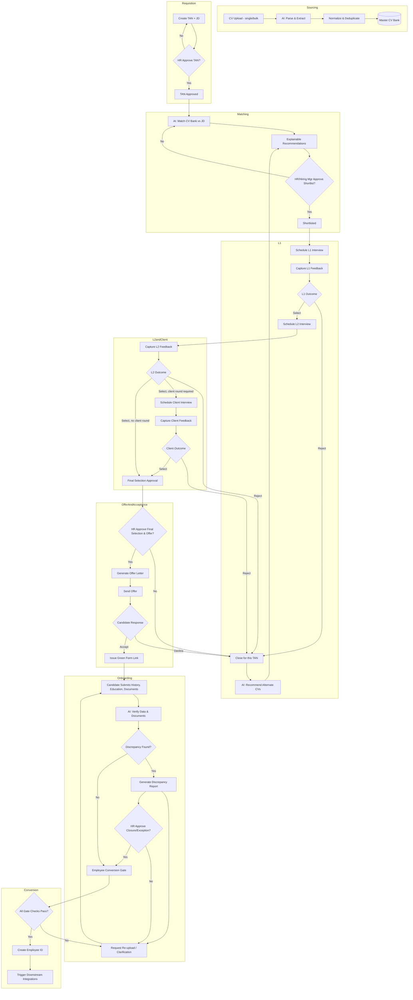

# End-to-End Recruitment & Onboarding Workflow

> Title: End-to-End Recruitment & Onboarding Workflow | Version: 1.0 | Owner: [TENANT_CONFIGURATION_REQUIRED — HR Process Owner] | Status: Draft | Last reviewed: 2026-09-07 | Next review: [TENANT_CONFIGURATION_REQUIRED] | Reviewers: HR, Product, Architecture, Security

## Table of contents

1. [Purpose and scope](#purpose-and-scope)
2. [Actors](#actors)
3. [Full workflow diagram](#full-workflow-diagram)
4. [Stage-by-stage detail](#stage-by-stage-detail)
5. [Rejection and alternate-CV loop](#rejection-and-alternate-cv-loop)
6. [Green Form and discrepancy loop](#green-form-and-discrepancy-loop)
7. [Employee-conversion gate checklist](#employee-conversion-gate-checklist)
8. [Configurable workflow stages by tenant](#configurable-workflow-stages-by-tenant)
9. [Cross-references](#cross-references)
10. [Change control](#change-control)

## Purpose and scope

Describes the full candidate journey and system behavior from CV upload to Employee ID creation and downstream integration triggers. Complements the formal [workflow-state-machine.md](workflow-state-machine.md) (statuses/transitions), [human-approval-matrix.md](human-approval-matrix.md) (who approves what), and [sla-escalation-rules.md](sla-escalation-rules.md) (timing).

## Actors

Recruiter, Hiring Manager, HR Approver, Interview Panelist, HR Operations, Candidate, AI Agents (extraction/matching/drafting only). See [personas-and-roles.md](../00-product/personas-and-roles.md).

## Full workflow diagram

## Stage-by-stage detail

| # | Stage | Trigger | Primary actor | AI role | Human gate |
|---|---|---|---|---|---|
| 1 | CV upload | Recruiter/candidate/bulk import | Recruiter | — | — |
| 2 | Parse/normalize/dedupe | Upload completed | System (AI extraction) | Extract fields, flag duplicates | Recruiter reviews low-confidence extractions |
| 3 | TAN creation | New requisition | Recruiter/Hiring Manager | Draft JD summary (optional) | HR approves TAN before matching |
| 4 | AI matching | TAN approved | System | Score & rank CVs, generate rationale | — |
| 5 | Recommendation review | Match complete | Recruiter/Hiring Manager | Present ranked, explainable list | — |
| 6 | Shortlist approval | Recommendations reviewed | HR/Hiring Manager | — | **Mandatory approval** |
| 7 | L1 scheduling | Shortlist approved | Recruiter | Suggest slots (via calendar MCP) | — |
| 8 | L1 feedback | Interview completed | Panelist | Summarize feedback (assist only) | Panelist submits, is not overridden by AI |
| 9 | L1 reject → close & alternates | L1 outcome = reject | System | Recommend alternate CVs | — |
| 10 | L2 scheduling | L1 select | Recruiter | Suggest slots | — |
| 11 | Client interview (if required) | L2 select + config flag | Recruiter | Suggest slots | — |
| 12 | Final selection approval | All rounds complete | HR Approver | — | **Mandatory approval** |
| 13 | Offer generation | Final selection approved | System | Draft offer from template | HR approves before send |
| 14 | Offer send/acceptance | Offer approved | Candidate | — | Candidate action (external) |
| 15 | Green Form issuance | Offer accepted | System | — | — |
| 16 | Document/history collection | Green Form issued | Candidate | Pre-check completeness | — |
| 17 | Verification | Submission complete | System | Cross-check documents/data | — |
| 18 | Discrepancy handling | Verification fails | HR Operations | Draft discrepancy report | HR approves closure/exception |
| 19 | Employee conversion | Verification clean or exception approved | HR Approver | — | **Mandatory approval** |
| 20 | Employee ID creation | Conversion approved | System | — | — |
| 21 | Downstream integration triggers | Employee created | System (event-driven) | — | Per-integration config |

## Rejection and alternate-CV loop

A rejection at L1, L2, or client stage closes the candidate **only for the current TAN** (candidate remains in the CV Bank for future TANs unless independently withdrawn). The system automatically re-runs AI matching against the same approved TAN, excluding already-processed candidates, and routes new recommendations back to shortlist review (Section 6 of the table above). See [workflow-state-machine.md](workflow-state-machine.md#rejection-loop) for the formal transition.

## Green Form and discrepancy loop

1. Green Form link is single-use, time-bound, and scoped to one candidate/TAN/offer.
2. Candidate submits employment history, education, and documents defined by the configurable checklist (`config/defaults/workflow.default.yaml`).
3. AI verification cross-checks documents against submitted data and flags discrepancies with a confidence score — it does not decide pass/fail.
4. Every discrepancy produces a structured report (type, severity, evidence, suggested action).
5. HR Operations can request re-upload/clarification without escalation; **closing** a discrepancy (accepting it as resolved or granting an exception) always requires HR Approver sign-off.
6. The loop (submit → verify → discrepancy → re-upload) can repeat up to a configurable maximum attempt count before automatic escalation (see [sla-escalation-rules.md](sla-escalation-rules.md)).

## Employee-conversion gate checklist

| Check | Source | Blocking? |
|---|---|---|
| Offer accepted | Offer service | Yes |
| Green Form fully submitted | Green Form service | Yes |
| All required documents verified or discrepancy exception approved | Verification service | Yes |
| No open, unapproved discrepancies | Discrepancy service | Yes |
| Compensation/grade data present and within policy | HRMS/Compensation reference (external) | Yes |
| HR Approver sign-off recorded | Approval service (audit log) | Yes |
| Duplicate-employee check passed | Employee master | Yes |

## Configurable workflow stages by tenant

Tenants may: disable the client-interview stage, add additional interview rounds, change document checklists, change approval matrix composition, and change SLA thresholds — all via `config/defaults/workflow.default.yaml` overridden per tenant in `config/tenants/`. Tenants may **not** remove a mandatory human-approval gate listed in [human-approval-matrix.md](human-approval-matrix.md) (enforced by schema validation, not just convention).

## Cross-references

[workflow-state-machine.md](workflow-state-machine.md) · [human-approval-matrix.md](human-approval-matrix.md) · [sla-escalation-rules.md](sla-escalation-rules.md) · [notification-catalog.md](notification-catalog.md) · [exception-handling-playbook.md](exception-handling-playbook.md) · [rest-api-catalog.md](../04-api/rest-api-catalog.md) · [hr-onboarding-events.asyncapi.yaml](../../asyncapi/hr-onboarding-events.asyncapi.yaml)

## Change control

| Version | Date | Author | Change |
|---|---|---|---|
| 1.0 | 2026-09-07 | Documentation package generation | Initial creation |
