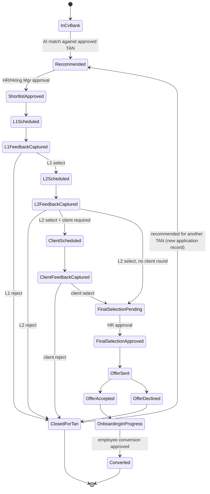
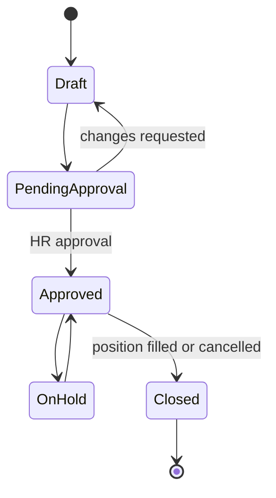
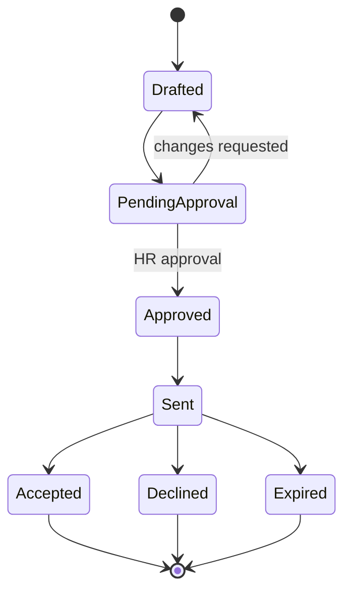
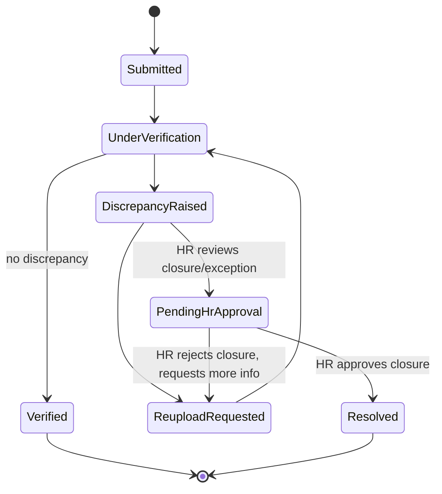
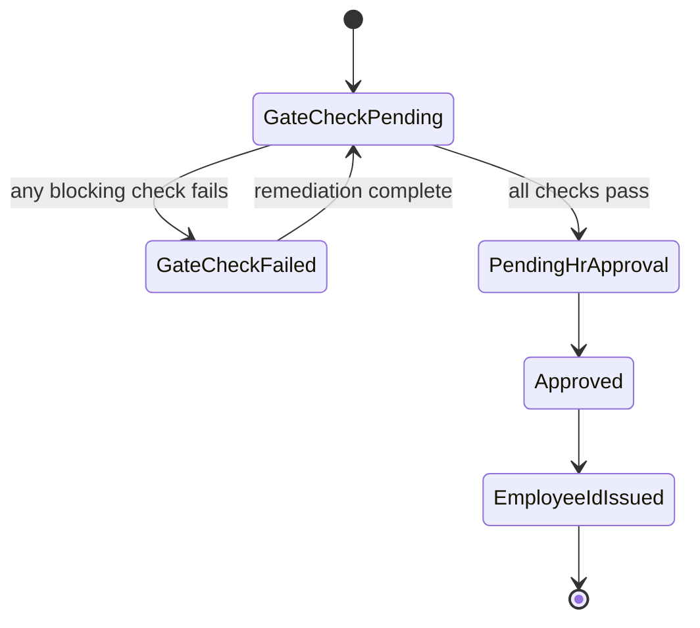

# Workflow State Machine

> Title: Workflow State Machine | Version: 1.1 | Owner: [TENANT_CONFIGURATION_REQUIRED — Architecture] | Status: Draft (target-state; only TAN status is implemented — see notice) | Last reviewed: 2026-09-08 | Next review: [TENANT_CONFIGURATION_REQUIRED] | Reviewers: Architecture, HR, Security

> **Implementation reality notice (2026-09-08):** there is no generic workflow-engine table backing these state machines (no `workflow_state_transition` table exists). Each business entity carries its own status column, and the stored procedure performing a transition enforces validity atomically with the write — see [ADR-006](../adr/ADR-006-database-first-stored-procedure-workflow.md). Of the state machines below, only **TAN/JobRequisition status** is implemented: `recruitment.JobRequisition.RequisitionStatusCode` moves `Draft → PendingApproval → Approved` (via `recruitment.usp_CreateJobRequisition` / `usp_SubmitJobRequisitionForApproval` / `usp_ApproveJobRequisition`) or `PendingApproval → Cancelled` (via `usp_RejectJobRequisition`). Candidate/application, offer, verification/discrepancy, and employee-conversion state machines described below have no backing code yet — their skills are unimplemented stubs (see [agent-skill-catalog.md](../06-ai-agents-rag/agent-skill-catalog.md)).

## Table of contents

1. [Purpose and scope](#purpose-and-scope)
2. [Design principle](#design-principle)
3. [Candidate/application status](#candidateapplication-status)
4. [TAN status](#tan-status)
5. [Offer status](#offer-status)
6. [Verification/discrepancy status](#verificationdiscrepancy-status)
7. [Employee conversion status](#employee-conversion-status)
8. [Allowed and forbidden transitions](#allowed-and-forbidden-transitions)
9. [Rejection loop](#rejection-loop)
10. [Versioning of the state machine](#versioning-of-the-state-machine)
11. [Change control](#change-control)

## Purpose and scope

Defines the deterministic, versioned state machines that govern workflow status. This state machine lives in the HR Core API / workflow engine — **never** inside an LLM or agent. Agents may propose a transition; only the workflow engine, after validating an approval record, commits it. See [ADR-002](../adr/ADR-002-agent-orchestration-pattern.md).

## Design principle

- Every transition is (a) deterministic given current state + event, (b) validated against the configured approval matrix, (c) versioned, and (d) written to the audit log ([audit-log-specification.md](../03-data/audit-log-specification.md)) in the same transaction as the state change (transactional outbox — see [ADR-001](../adr/ADR-001-transactional-system-of-record.md)).
- Illegal transitions are rejected with `409 Conflict` / RFC 7807 problem detail (see [error-handling-and-problem-details.md](../04-api/error-handling-and-problem-details.md)).

## Candidate/application status

## TAN status

## Offer status

## Verification/discrepancy status

## Employee conversion status

## Allowed and forbidden transitions

| From | To | Allowed if | Forbidden without |
|---|---|---|---|
| `Recommended` | `ShortlistApproved` | Recorded HR/Hiring Manager approval | Approval record |
| `L1FeedbackCaptured` | `L2Scheduled` | L1 outcome = select, recorded by panelist | Human-submitted feedback |
| `FinalSelectionPending` | `FinalSelectionApproved` | Recorded HR approval | Approval record |
| `FinalSelectionApproved` | `OfferSent` | Offer approved and generated from template | HR approval on offer |
| `DiscrepancyRaised` | `Resolved`/exception | Recorded HR approval | Approval record — **AI may never auto-resolve** |
| `GateCheckPending` | `EmployeeIdIssued` | All blocking checks pass **and** HR approval recorded | Any blocking check unresolved, or missing approval |
| Any state | Any non-adjacent state ("skip") | Never | — |
| Any state | Terminal state via AI action alone | Never | Human approval per [human-approval-matrix.md](human-approval-matrix.md) |

## Rejection loop

Rejection at any interview stage transitions the application to `ClosedForTan` (terminal for that TAN) and emits `application.rejected`. A new `Recommended` application record may be created for the same candidate against a *different* TAN. The candidate's CV Bank record is untouched. See [end-to-end-recruitment-onboarding-workflow.md](end-to-end-recruitment-onboarding-workflow.md#rejection-and-alternate-cv-loop).

## Versioning of the state machine

State-machine definitions are versioned (`workflow_config_version` in [workflow-config.schema.json](../../config/schemas/workflow-config.schema.json)). In-flight applications continue on the version they started under; new applications use the latest approved version. Changing allowed transitions requires an ADR update and a migration plan (see [database-migration-strategy.md](../03-data/database-migration-strategy.md)).

## Change control

| Version | Date | Author | Change |
|---|---|---|---|
| 1.0 | 2026-09-07 | Documentation package generation | Initial creation |
