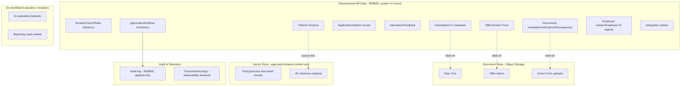

# Data Architecture

> Title: Data Architecture | Version: 1.1 | Owner: [TENANT_CONFIGURATION_REQUIRED — Data Architecture] | Status: Draft (domain-separation model still valid; engine choice now fixed — see notice) | Last reviewed: 2026-09-08 | Next review: [TENANT_CONFIGURATION_REQUIRED] | Reviewers: Architecture, Security, DBA

> **Implementation reality notice (2026-09-08):** the transactional/document/vector data-domain separation below is still the real direction and matches what's implemented. The engine choice originally left open (see "Assumptions and dependencies") is now fixed: the real database is SQL Server, `HrAutomationDb`, implemented database-first at `src/HrAutomation.Infrastructure/Database/scripts/`, not the flat Postgres-style sample in [sample-relational-schema.sql](sample-relational-schema.sql)/[data-dictionary.md](data-dictionary.md). Object storage and vector-store integration described below have not been implemented yet (`Planned`).

## Purpose and scope

Defines the separation of data domains, storage technologies, and data-flow boundaries. This is a **technical baseline requiring DBA/security review** before implementation — see [sample-relational-schema.sql](sample-relational-schema.sql) header.

## Data domain separation

## Separation principles

| Domain | Storage | Authoritative for | Never used as authoritative for |
|---|---|---|---|
| Transactional HR data | Relational DB | Workflow status, approvals, offers, employee records | — |
| Documents | Object storage | Raw file bytes | Any structured field (structured data lives in RDBMS, referencing the blob) |
| Embeddings | Vector store | Retrieval ranking for RAG | Workflow status, approvals, offers, employee records ([ADR-003](../adr/ADR-003-rag-and-vector-store-boundary.md)) |
| Audit/telemetry | RDBMS (audit log) + observability backend (traces/metrics) | Historical record of actions and system behavior | Live query path for application logic |
| Analytics/evaluation | Read-model / analytics store, de-identified | Reporting, AI evaluation | Any live workflow decision |

## Data flow: CV to CV Bank

1. Recruiter uploads CV → Document Service stores raw file in object storage, emits `candidate.cv_uploaded`.
2. Agent Plane parses file (async), extracts structured fields, returns JSON-Schema-validated result.
3. HR Core API writes structured candidate/CV metadata to RDBMS (with blob reference), runs dedup rules, emits `candidate.cv_parsed`.
4. Low-confidence extractions route to a manual-review queue (never silently auto-accepted).

## Retention and deletion

See [data-classification-and-retention.md](data-classification-and-retention.md) for retention periods and the deletion/legal-hold workflow.

## Assumptions and dependencies

Originally scoped as a per-tenant choice between Postgres or SQL Server; the real implementation fixed this to **SQL Server** (HrAutomationDb), not a runtime/tenant-configurable choice — see the implementation notice above. Assumes one object-storage provider per tenant; multi-provider-per-tenant is out of scope for v1.

## Risks and open questions

- Whether a separate OLAP/analytics store is needed at scale, or read replicas suffice — pending volume projections.

## Change control

| Version | Date | Author | Change |
|---|---|---|---|
| 1.0 | 2026-09-07 | Documentation package generation | Initial creation |
