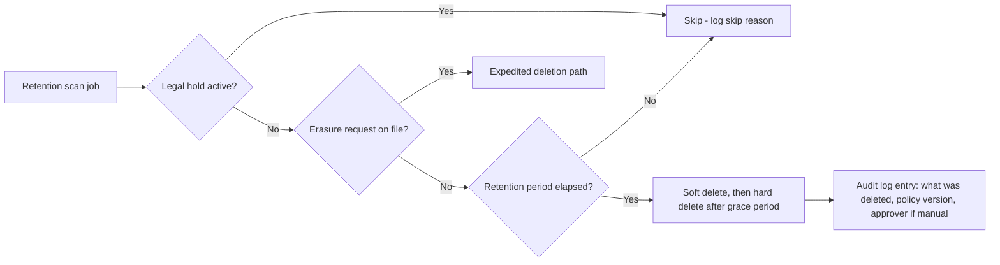

# Data Classification and Retention

> Title: Data Classification and Retention | Version: 1.0 | Owner: [TENANT_CONFIGURATION_REQUIRED — Privacy/Compliance] | Status: Draft | Last reviewed: 2026-09-07 | Next review: [TENANT_CONFIGURATION_REQUIRED] | Reviewers: Legal, Security, HR

## Purpose and scope

Defines data classification tiers and default retention periods. Actual retention periods, legal basis, and deletion triggers are [LEGAL_REVIEW_REQUIRED] / [TENANT_POLICY_REQUIRED] — values here are conservative placeholders for planning only.

## Classification tiers

| Tier | Definition | Examples |
|---|---|---|
| Public | No confidentiality requirement | Published JD summaries (if org chooses) |
| Internal | Internal business data, low sensitivity | TAN metadata, workflow status |
| Confidential | Sensitive business or personal data | Candidate PII, interview feedback, compensation |
| Restricted | Highest sensitivity, regulatory exposure | Government ID numbers, background-check results, health-related data (if ever present — should be minimized/excluded per [fairness-and-bias-governance.md](../05-security-governance/fairness-and-bias-governance.md)) |

## Retention defaults (illustrative — [LEGAL_REVIEW_REQUIRED])

| Data category | Classification | Default retention | Trigger for deletion |
|---|---|---|---|
| CV Bank record (non-hired candidate) | Confidential | [LEGAL_REVIEW_REQUIRED — e.g., 24 months from last activity] | Retention expiry or candidate erasure request |
| Application/interview feedback | Confidential | Tied to candidate record retention | Same as candidate record, unless legal hold |
| Offer documents | Confidential | [LEGAL_REVIEW_REQUIRED] | Retention expiry |
| Green Form documents (non-hired) | Restricted | Deleted promptly after process closure unless legally required otherwise | [LEGAL_REVIEW_REQUIRED] |
| Employee master record | Confidential | Per employment record retention law | [LEGAL_REVIEW_REQUIRED] |
| Audit log | Internal/Confidential | [TENANT_POLICY_REQUIRED — typically longer than operational data] | Retention expiry (audit logs are last to be purged) |
| RAG source documents | Internal | Until superseded by new version | Version supersession or policy withdrawal |
| Evaluation datasets | De-identified where feasible | [TENANT_CONFIGURATION_REQUIRED] | N/A if fully de-identified |

## Legal hold

When a legal hold is placed on a candidate/employee record (e.g., pending dispute), all scheduled deletion for that record and its linked entities (applications, documents, approvals) is suspended until the hold is lifted. Legal hold status is a first-class field, checked by the retention job before any deletion runs — see `retention-policy.schema.json`.

## Deletion workflow

## Right to erasure / data subject requests

Process for handling candidate erasure requests is [LEGAL_REVIEW_REQUIRED]. At minimum: request intake, identity verification of requester, scope determination (what must legally be retained vs. deleted), execution, and audit logging of the erasure itself (metadata only, not the erased content).

## Configurable items

Retention periods per data category, legal-hold workflow triggers, and deletion grace periods are tenant-configurable via `config/schemas/retention-policy.schema.json`.

## Change control

| Version | Date | Author | Change |
|---|---|---|---|
| 1.0 | 2026-09-07 | Documentation package generation | Initial creation |
