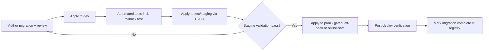

# Database Migration Strategy

> Title: Database Migration Strategy | Version: 1.0 | Owner: [TENANT_CONFIGURATION_REQUIRED — DBA/Architecture] | Status: Draft | Last reviewed: 2026-09-07 | Next review: [TENANT_CONFIGURATION_REQUIRED] | Reviewers: DBA, Architecture, DevOps

## Purpose and scope

Defines how schema changes are proposed, reviewed, applied, and rolled back across environments without downtime or data loss, for the system of record described in [data-architecture.md](data-architecture.md).

## Principles

1. Every schema change is a versioned, reviewable migration script (tooling: framework-native migrations, e.g., EF Core Migrations, Flyway, Liquibase — [TENANT_CONFIGURATION_REQUIRED]).
2. Migrations are additive-first: add new columns/tables nullable or defaulted, backfill, then tighten constraints in a later migration — avoiding long locks and breaking in-flight application code.
3. No migration drops a column/table in the same release that stops writing to it; a deprecation window is required (see [versioning-and-deprecation-policy.md](../04-api/versioning-and-deprecation-policy.md) for the analogous API pattern).
4. Migrations affecting workflow-state-machine tables require a corresponding update to `workflow-config.schema.json` version and an ADR note if transition semantics change (see [workflow-state-machine.md](../02-business-workflows/workflow-state-machine.md#versioning-of-the-state-machine)).
5. Every migration is applied identically across dev → test → staging → prod via CI/CD ([ci-cd-quality-gates.md](../10-delivery/ci-cd-quality-gates.md)); no manual prod schema edits.

## Migration flow

## Rollback strategy

- Every migration includes a tested down-script or a documented forward-fix-only rationale (some data migrations are not safely reversible — document why).
- Rollback is preferred via forward-fix migration rather than reverse-execution against a live system with new data, to avoid data loss.

## Tenant/environment considerations

Multi-tenant shared-schema deployments apply migrations once per database instance; dedicated-infrastructure tenants apply the same migration set independently, tracked in a per-tenant migration registry.

## Assumptions and dependencies

Specific migration tooling and off-peak windows are [TENANT_CONFIGURATION_REQUIRED].

## Risks and open questions

- Zero-downtime requirement strength (some tenants may tolerate brief maintenance windows, others may not) — [TENANT_CONFIGURATION_REQUIRED].

## Change control

| Version | Date | Author | Change |
|---|---|---|---|
| 1.0 | 2026-09-07 | Documentation package generation | Initial creation |
