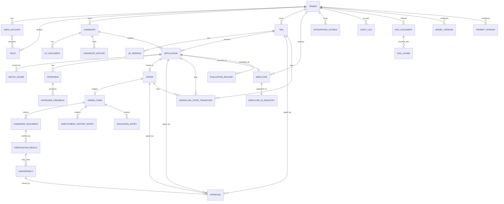

# Entity-Relationship Diagram

> Title: ER Diagram | Version: 1.1 | Owner: [TENANT_CONFIGURATION_REQUIRED — Data Architecture] | Status: Draft (original target-state baseline; superseded in part — see notice below) | Last reviewed: 2026-09-08 | Next review: [TENANT_CONFIGURATION_REQUIRED] | Reviewers: DBA, Architecture, Security

> **Implementation reality notice (2026-09-08):** this diagram visualizes the original target-state design in [data-dictionary.md](data-dictionary.md), which does not match the real, implemented `HrAutomationDb` schema (243 tables, schema-qualified PascalCase, no single `TAN`/`APPROVAL`/`WORKFLOW_STATE_TRANSITION` entity). See the notice at the top of [data-dictionary.md](data-dictionary.md) for the specifics and [ADR-006](../adr/ADR-006-database-first-stored-procedure-workflow.md) for the reasoning. No ER diagram generated from the real schema exists yet — that is a `Planned` item.

## Purpose and scope

Visualizes the core entity relationships backing [sample-relational-schema.sql](sample-relational-schema.sql) and [data-dictionary.md](data-dictionary.md). This is a technical baseline, not a final physical design — requires DBA/security review before implementation.

## Diagram

## Notes

- All entities carry `tenant_id`, `id` (UUID), `created_at`, `created_by`, `updated_at`, `updated_by`, and most carry a `version` (optimistic concurrency) and `is_deleted` (soft delete) — see [data-dictionary.md](data-dictionary.md).
- `APPROVAL` is modeled as a first-class entity referenced by TAN, APPLICATION (shortlist/final selection), OFFER, and DISCREPANCY to give a single auditable approval trail (see [audit-log-specification.md](audit-log-specification.md)).
- `RAG_DOCUMENT`/`RAG_CHUNK` are logically separate from transactional entities and may live in a different physical store (vector store) — see [ADR-003](../adr/ADR-003-rag-and-vector-store-boundary.md).

## Change control

| Version | Date | Author | Change |
|---|---|---|---|
| 1.0 | 2026-09-07 | Documentation package generation | Initial creation |
