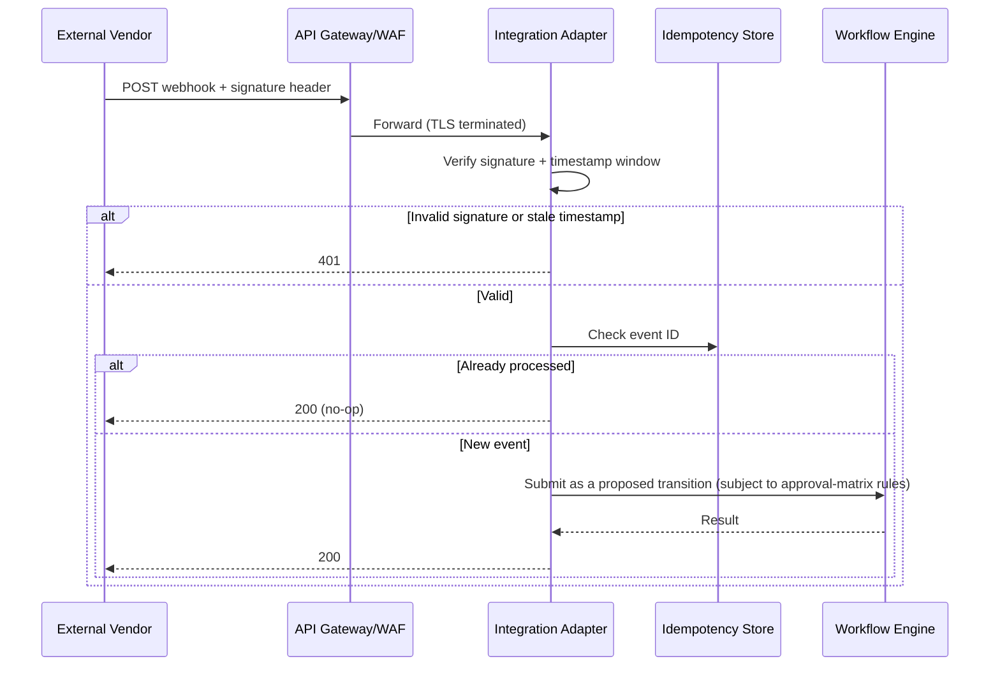

# Webhook Security

> Title: Webhook Security | Version: 1.0 | Owner: [TENANT_CONFIGURATION_REQUIRED — Security Architecture] | Status: Draft | Last reviewed: 2026-09-07 | Next review: [TENANT_CONFIGURATION_REQUIRED] | Reviewers: Security, Architecture

## Purpose and scope

Defines security requirements for inbound webhooks from external systems (e.g., e-signature completion callbacks, background-verification result callbacks) received via MCP adapters or the Integration Adapter layer (see [integration-architecture.md](../01-architecture/integration-architecture.md)).

## Requirements

| Control | Requirement |
|---|---|
| Signature verification | Every inbound webhook must carry a vendor-provided signature (HMAC or equivalent); requests without a valid signature are rejected with `401`, not processed |
| Replay protection | Reject requests with a timestamp outside a configurable tolerance window (default: 5 minutes) even with a valid signature |
| Idempotency | Webhook payloads carry a vendor event ID; duplicate deliveries are deduplicated via the inbox/idempotency store before triggering any workflow action |
| Least privilege | Webhook endpoints accept only the specific payload shape expected from that vendor/integration; unexpected fields are ignored, not reflected |
| Network exposure | Webhook endpoints are exposed only through the API gateway/WAF, never directly from an internal service |
| Secrets | Webhook signing secrets are stored in the vault, rotated per [secrets-and-key-management.md](../05-security-governance/secrets-and-key-management.md) |
| Audit | Every accepted/rejected webhook call is logged (see [audit-log-specification.md](../03-data/audit-log-specification.md)) |
| Untrusted content | Webhook payload content (e.g., a background-verification note field) is treated as untrusted input subject to the same prompt-injection defenses as other external content if it is ever passed to an AI skill (see [prompt-injection-defense.md](../05-security-governance/prompt-injection-defense.md)) |

## Processing flow

## Change control

| Version | Date | Author | Change |
|---|---|---|---|
| 1.0 | 2026-09-07 | Documentation package generation | Initial creation |
