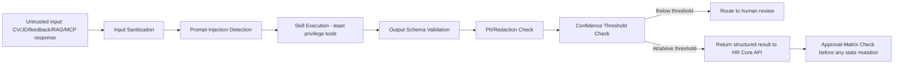

# AI Guardrails Policy

> Title: AI Guardrails Policy | Version: 1.0 | Owner: [TENANT_CONFIGURATION_REQUIRED — AI Governance Lead] | Status: Draft | Last reviewed: 2026-09-07 | Next review: [TENANT_CONFIGURATION_REQUIRED] | Reviewers: AI Governance, Security, HR, Legal

## Purpose and scope

Defines the non-negotiable boundaries on AI behavior across the platform, enforced structurally (in the Guardrail Pipeline and Workflow Engine — see [ADR-002](../adr/ADR-002-agent-orchestration-pattern.md)), not merely by prompt instruction.

## What AI may do

Recommend, extract, classify, summarize, draft, route, and alert — always producing structured, reviewable output.

## What AI must never do (non-negotiable)

| Forbidden action | Enforcement mechanism |
|---|---|
| Autonomously reject or select a candidate | Workflow Engine requires a human `interview_feedback` or `progression-decision` record; no skill has a code path to write this directly |
| Autonomously release an offer | `offer.send` only proceeds if `offer.approve` was previously recorded by an `hr_approver` |
| Determine or alter compensation figures | Offer schema requires a `compensationRef` into an external comp system; no free-text AI-generated figure is accepted |
| Close a discrepancy or grant an exception | `discrepancy.resolve` requires an `ApprovalDecisionRequest` from an `hr_approver` |
| Create an Employee ID | `employee-conversion` endpoint requires a recorded approval and a fully-passed gate checklist |

See [human-approval-matrix.md](../02-business-workflows/human-approval-matrix.md) for the complete gate list.

## Guardrail pipeline stages

## Confidence thresholds (configurable — see `config/schemas/rag-config.schema.json` and `model-routing.schema.json`)

| Skill | Default minimum confidence | Below-threshold action |
|---|---|---|
| CV field extraction | 0.75 | Route to manual review queue |
| Candidate matching score inclusion | 0.60 | Exclude candidate from recommendation, do not silently include as a weak match |
| Document verification | 0.80 | Flag as `needs_review`, never auto-pass |
| RAG policy answer | 0.65 (retrieval relevance) | Return no-answer fallback with citation prompt to consult HR directly |

## Required human-review triggers

- Any output below the confidence threshold above.
- Any detected prompt-injection attempt (see [prompt-injection-defense.md](prompt-injection-defense.md)).
- Any candidate flagged as a possible duplicate.
- Any discrepancy above `medium` severity.
- Any output that would (directly or indirectly) touch a forbidden action above.

## Governance of prompts and models

Prompt and model changes follow versioning, approval, testing, and rollback rules in [prompt-management.md](../06-ai-agents-rag/prompt-management.md) and [model-routing-and-cost-controls.md](../06-ai-agents-rag/model-routing-and-cost-controls.md). No prompt/model change ships to production without passing the evaluation suite in [ai-evaluation-strategy.md](../06-ai-agents-rag/ai-evaluation-strategy.md).

## Change control

| Version | Date | Author | Change |
|---|---|---|---|
| 1.0 | 2026-09-07 | Documentation package generation | Initial creation |
