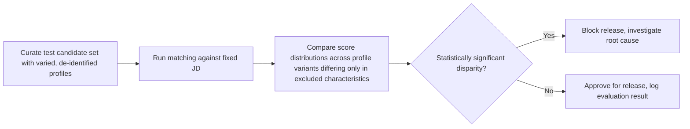

# Fairness and Bias Governance

> Title: Fairness and Bias Governance | Version: 1.0 | Owner: [TENANT_CONFIGURATION_REQUIRED — AI Governance Lead] | Status: Draft | Last reviewed: 2026-09-07 | Next review: [TENANT_CONFIGURATION_REQUIRED] | Reviewers: AI Governance, HR, Legal, Security

## Purpose and scope

Defines fairness requirements for AI-assisted candidate matching and the process for testing and reviewing for bias. Definitions of "protected characteristic" vary by jurisdiction — [LEGAL_REVIEW_REQUIRED] for the authoritative list per deployment region.

## Excluded characteristics (default — extend per jurisdiction, [LEGAL_REVIEW_REQUIRED])

Age, gender, religion, caste, disability, marital status, ethnicity, photo, nationality, family status, and any other characteristic unrelated to job-relevant qualifications.

## Matching design rules

- CV extraction schema does not include fields for the excluded characteristics above; if source documents contain photos or such data, extraction skills must not surface them to the matching skill.
- Matching criteria are limited to mandatory/preferred JD criteria explicitly authored by the requester (skills, experience, certifications) — see [candidate-matching-system-prompt.md](../../prompts/system/candidate-matching-system-prompt.md).
- Match rationale must reference specific job-relevant criteria, not holistic/unexplained scores — supports explainability and auditability of fairness.
- Matching weights are configurable but validated against a schema that rejects any weight tied to an excluded characteristic (`config/schemas/rag-config.schema.json` / matching-weight config — enforcement point: [TENANT_CONFIGURATION_REQUIRED] validation rule).

## Fairness testing process

See [ai-evaluation-strategy.md](../06-ai-agents-rag/ai-evaluation-strategy.md) for how this integrates into the release pipeline, and [ai-evaluation-scorecard.md](../09-quality-evaluation/ai-evaluation-scorecard.md) for scorecard fields.

## Review cadence

Fairness testing runs on every prompt/model version change affecting the matching skill, and on a configurable periodic cadence (default: quarterly — [TENANT_CONFIGURATION_REQUIRED]) even without a change, to catch drift.

## Human oversight

Regardless of fairness testing results, every shortlist decision requires human approval (see [human-approval-matrix.md](../02-business-workflows/human-approval-matrix.md)); AI recommendations are advisory inputs, not determinative outputs.

## Escalation

Any detected bias incident is handled per [incident-response-runbook.md](incident-response-runbook.md) and logged in [model-risk-register.md](../06-ai-agents-rag/model-risk-register.md).

## Change control

| Version | Date | Author | Change |
|---|---|---|---|
| 1.0 | 2026-09-07 | Documentation package generation | Initial creation |
