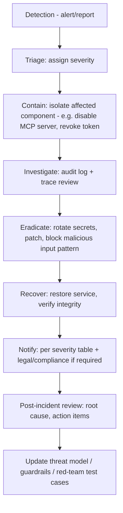

# Incident Response Runbook

> Title: Incident Response Runbook | Version: 1.0 | Owner: [TENANT_CONFIGURATION_REQUIRED — Security Operations] | Status: Draft | Last reviewed: 2026-09-07 | Next review: [TENANT_CONFIGURATION_REQUIRED] | Reviewers: Security, Legal, Compliance

## Purpose and scope

Defines severity classification and response process for security incidents, including AI-specific incidents (prompt injection success, guardrail bypass, fairness incident). Complements [on-call-runbook.md](../08-operations-observability/on-call-runbook.md) (operational incidents) and [exception-handling-playbook.md](../02-business-workflows/exception-handling-playbook.md) (workflow exceptions).

## Severity classification

| Severity | Definition | Example | Notification target |
|---|---|---|---|
| SEV-1 (Critical) | Confirmed data breach, cross-tenant data exposure, or unauthorized sensitive action (offer sent / employee created without approval) | Cross-tenant candidate data returned to wrong tenant | Executive/Legal, all hands, [LEGAL_REVIEW_REQUIRED breach-notification obligations] |
| SEV-2 (High) | Successful prompt injection altering a recommendation, guardrail bypass, credential compromise | Manipulated CV caused an inflated match score that reached a human approver | Security lead, AI Governance Lead |
| SEV-3 (Medium) | Contained guardrail trigger, failed injection attempt, isolated MCP server outage with no data exposure | Injection attempt detected and blocked by input sanitization | Security on-call |
| SEV-4 (Low) | Anomaly requiring investigation, no confirmed impact | Unusual confidence-score pattern flagged by monitoring | Security on-call (next business day) |

## Response process

## AI-specific incident handling

- **Prompt injection success:** quarantine the source document/content, add pattern to [prompt-injection-test-cases.md](../../prompts/red-team/prompt-injection-test-cases.md), review all decisions influenced by that content within the exposure window via audit log.
- **Guardrail bypass:** roll back the affected prompt/model version per [prompt-management.md](../06-ai-agents-rag/prompt-management.md) rollback procedure; re-run [ai-evaluation-strategy.md](../06-ai-agents-rag/ai-evaluation-strategy.md) suite before re-release.
- **Fairness incident:** escalate per [fairness-and-bias-governance.md](fairness-and-bias-governance.md); pause the matching skill for affected tenant/JD scope pending investigation if disparity is severe.
- **Unauthorized sensitive action (should be structurally impossible per [ai-guardrails-policy.md](ai-guardrails-policy.md)):** treat as SEV-1 regardless of actual harm — indicates a control failure requiring architecture review.

## Post-incident requirements

Every SEV-1/SEV-2 incident produces a written post-incident review with root cause, timeline, and remediation owner/date, reviewed by Security and AI Governance. [LEGAL_REVIEW_REQUIRED] for any incident involving candidate/employee PII to determine notification obligations.

## Change control

| Version | Date | Author | Change |
|---|---|---|---|
| 1.0 | 2026-09-07 | Documentation package generation | Initial creation |
