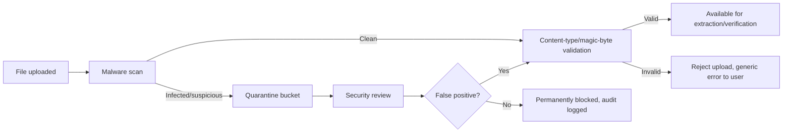

# Secure File Upload Policy

> Title: Secure File Upload Policy | Version: 1.0 | Owner: [TENANT_CONFIGURATION_REQUIRED — Security Architecture] | Status: Draft | Last reviewed: 2026-09-07 | Next review: [TENANT_CONFIGURATION_REQUIRED] | Reviewers: Security, Architecture

## Purpose and scope

Defines controls for all file uploads: CVs, JD attachments, Green Form documents. Applies to the Document Service ([component-architecture.md](../01-architecture/component-architecture.md)).

## Controls

| Control | Requirement |
|---|---|
| Malware/virus scanning | Every uploaded file is scanned before being made available for extraction or download; quarantined files are never processed further |
| Content-type validation | Declared MIME type is verified against actual file content (magic-byte check), not trusted from the client header alone |
| File size limits | Configurable per document type (default conservative limits — [TENANT_CONFIGURATION_REQUIRED]) |
| Allowed formats | Configurable allow-list (e.g., PDF, DOCX for CVs; PDF/JPEG/PNG for Green Form documents) — reject all others |
| Filename handling | Original filename is stored as metadata only; storage key is a generated UUID, never the raw filename (avoids path traversal / injection) |
| Storage location | Object storage only, referenced by ID from the RDBMS — never stored inline in the database |
| Access control | Signed URLs with short TTL for download; no permanently public URLs |
| Quarantine workflow | Files failing scan are moved to a quarantine bucket/prefix with restricted access, flagged for security review, and the uploader is notified generically (no malware detail disclosed) |

## Quarantine flow

## Relationship to malware scanning implementation

The current codebase defines `IMalwareScanner` as an interface pending a real integration (e.g., ClamAV, a cloud AV API) — see the platform's implementation backlog. No file may bypass this interface's scan step even while a stub/no-op implementation exists in early environments; a no-op scanner must never be used in staging/prod.

## Change control

| Version | Date | Author | Change |
|---|---|---|---|
| 1.0 | 2026-09-07 | Documentation package generation | Initial creation |
