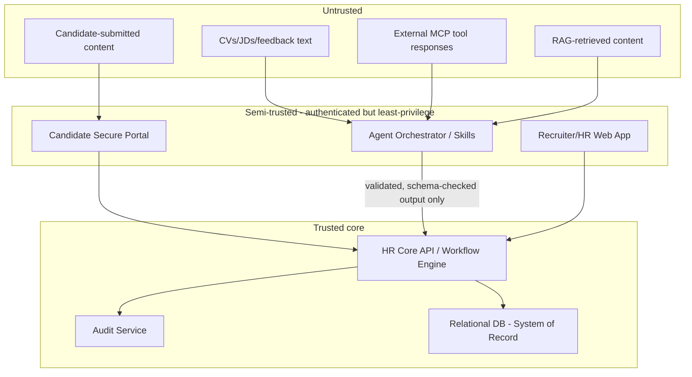

# Security Architecture

> Title: Security Architecture | Version: 1.0 | Owner: [TENANT_CONFIGURATION_REQUIRED — Security Architecture] | Status: Draft | Last reviewed: 2026-09-07 | Next review: [TENANT_CONFIGURATION_REQUIRED] | Reviewers: Security, Architecture, Compliance

## Table of contents

1. [Purpose and scope](#purpose-and-scope)
2. [Zero-trust principles applied](#zero-trust-principles-applied)
3. [Trust boundaries](#trust-boundaries)
4. [Encryption](#encryption)
5. [Access control layers](#access-control-layers)
6. [Tenant isolation](#tenant-isolation)
7. [Cross-references](#cross-references)
8. [Change control](#change-control)

## Purpose and scope

Defines the security architecture underpinning the platform: zero-trust posture, encryption, access control, and tenant isolation. Complements [threat-model.md](threat-model.md) (abuse cases), [identity-access-control.md](identity-access-control.md) (RBAC/ABAC detail), and [ADR-004](../adr/ADR-004-mcp-security-model.md) (MCP isolation).

## Zero-trust principles applied

- No implicit trust between services, even within the same network segment; every call is authenticated and authorized.
- Least privilege by default for every role, service principal, and agent skill.
- Assume breach: design so a single compromised component has bounded blast radius (see MCP isolation, [ADR-004](../adr/ADR-004-mcp-security-model.md)).
- All external content (CVs, JDs, feedback, emails, calendar data, RAG-retrieved content, MCP tool responses) is treated as untrusted input — see [prompt-injection-defense.md](prompt-injection-defense.md).

## Trust boundaries

Nothing crosses from Untrusted directly into Trusted without passing through a validation/guardrail layer (Guardrail Pipeline, Output Validator — see [component-architecture.md](../01-architecture/component-architecture.md)).

## Encryption

| Layer | Requirement |
|---|---|
| In transit | TLS 1.2+ everywhere, including internal service-to-service and MCP calls |
| At rest — database | Transparent data encryption at the storage layer, plus application-layer (column-level) encryption for PII fields (see [sample-relational-schema.sql](../03-data/sample-relational-schema.sql)) |
| At rest — object storage | Server-side encryption, customer-managed key option for high-sensitivity tenants |
| At rest — vector store | Encryption at rest per provider; no raw PII embedded by default (see [rag-architecture.md](../06-ai-agents-rag/rag-architecture.md)) |
| Key management | Vault-based (Azure Key Vault, AWS KMS, HashiCorp Vault, etc.) — see [secrets-and-key-management.md](secrets-and-key-management.md) |

## Access control layers

1. **Network:** default-deny network policies between namespaces/services (see [deployment-architecture.md](../01-architecture/deployment-architecture.md)).
2. **AuthN:** OAuth 2.1 / OIDC via the configured identity provider.
3. **AuthZ (RBAC):** role-to-scope mapping (see [identity-access-control.md](identity-access-control.md)).
4. **AuthZ (ABAC):** attribute checks — tenant, department, location, business unit — enforced server-side on every request.
5. **Approval-matrix enforcement:** a distinct layer from RBAC/ABAC; even an authorized role cannot commit a sensitive state transition without a recorded approval (see [human-approval-matrix.md](../02-business-workflows/human-approval-matrix.md)).

## Tenant isolation

Default: shared infrastructure, tenant-scoped data with `tenant_id` on every row plus row-level security (see [sample-relational-schema.sql](../03-data/sample-relational-schema.sql) RLS notes) and application-layer ABAC checks as defense in depth. High-sensitivity tenants may opt into dedicated infrastructure via deployment configuration, not a code fork.

## Cross-references

[threat-model.md](threat-model.md) · [ai-guardrails-policy.md](ai-guardrails-policy.md) · [identity-access-control.md](identity-access-control.md) · [privacy-and-pii-handling.md](privacy-and-pii-handling.md) · [secrets-and-key-management.md](secrets-and-key-management.md)

## Change control

| Version | Date | Author | Change |
|---|---|---|---|
| 1.0 | 2026-09-07 | Documentation package generation | Initial creation |
