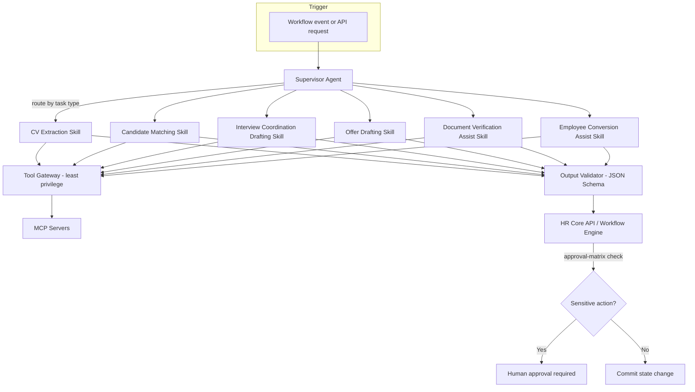

# Agent Architecture

> Title: Agent Architecture | Version: 1.1 | Owner: [TENANT_CONFIGURATION_REQUIRED — AI Governance Lead] | Status: Draft (target-state; most skills are unimplemented stubs — see notice) | Last reviewed: 2026-09-08 | Next review: [TENANT_CONFIGURATION_REQUIRED] | Reviewers: AI Governance, Architecture, Security

> **Implementation reality notice (2026-09-08):** there is no separate Supervisor Agent or Tool Gateway process. `HrAutomation.Api` controllers call `HrAutomation.Application`'s `IWorkflowOrchestrator`/`ISkillRegistry` in-process, which dispatch to `ISkill` implementations in `HrAutomation.Agents`. Of the skills this document describes, only CV extraction (`parse_cv_skill`) and the TAN create/approve skills (`create_tan_skill`, `tan_approval_skill`) have real logic; every other skill listed in [agent-skill-catalog.md](agent-skill-catalog.md) is a stub in `HrAutomation.Agents/Stubs/` that always returns `blocked`/"not yet implemented." `HrAutomation.Mcp` (the Tool Gateway/MCP servers this diagram shows) is an empty project scaffold — no MCP server exists to route to yet.

## Purpose and scope

Details the agent orchestration pattern decided in [ADR-002](../adr/ADR-002-agent-orchestration-pattern.md): a Supervisor Agent routing to Specialist Skills, all outside the deterministic Workflow Engine.

## Architecture

## Supervisor Agent responsibilities

- Classify incoming task, select the allow-listed skill(s) for that task type only (no skill can be invoked outside its declared trigger context).
- Enforce per-skill token/timeout budgets ([model-routing-and-cost-controls.md](model-routing-and-cost-controls.md)).
- Aggregate multi-skill results (e.g., matching may call extraction results) without exposing raw untrusted content across skill boundaries unnecessarily.
- Emit guardrail telemetry (confidence, tool calls made, approval state) per [ADR-005](../adr/ADR-005-observability-strategy.md).

## Specialist skills

See [agent-skill-catalog.md](agent-skill-catalog.md) for the full catalog with inputs/outputs/tools/confidence thresholds.

## Deterministic control boundary

The Supervisor and all skills run in the Agent Plane, architecturally separate from the Workflow Engine (see [component-architecture.md](../01-architecture/component-architecture.md)). No skill holds a database credential capable of writing workflow-state tables directly; all state mutation happens through the HR Core API, which independently enforces the approval matrix regardless of what the agent recommends.

## Failure handling

Skill timeouts, tool failures, or schema-validation failures result in a `needs_review` outcome routed to a human queue — never a silent fallback to an unvalidated default (see [ai-guardrails-policy.md](../05-security-governance/ai-guardrails-policy.md)).

## Change control

| Version | Date | Author | Change |
|---|---|---|---|
| 1.0 | 2026-09-07 | Documentation package generation | Initial creation |
