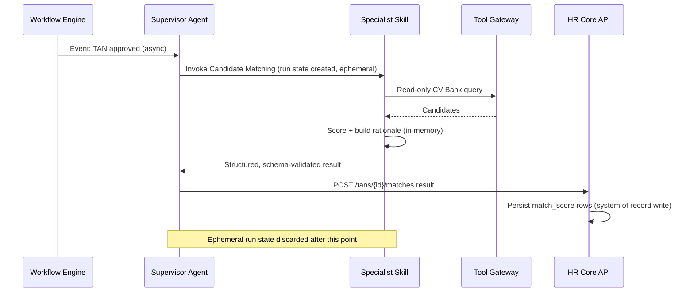

# Agent State and Orchestration

> Title: Agent State and Orchestration | Version: 1.0 | Owner: [TENANT_CONFIGURATION_REQUIRED — Architecture] | Status: Draft | Last reviewed: 2026-09-07 | Next review: [TENANT_CONFIGURATION_REQUIRED] | Reviewers: Architecture, AI Governance

## Purpose and scope

Clarifies the split between the **deterministic workflow state machine** (system of record, [workflow-state-machine.md](../02-business-workflows/workflow-state-machine.md)) and **agent run/session state** (ephemeral, Agent Plane only). This distinction is foundational to [ADR-001](../adr/ADR-001-transactional-system-of-record.md) and [ADR-002](../adr/ADR-002-agent-orchestration-pattern.md).

## The two kinds of state

| State type | Lives in | Lifetime | Authoritative for |
|---|---|---|---|
| Workflow state (TAN status, application status, offer status, etc.) | Relational DB | Persistent, permanent record | Everything the business cares about — approvals, audit, reporting |
| Agent run/session state (in-progress reasoning steps, intermediate tool-call results, retry counters within a single skill invocation) | Agent Plane (in-memory / short-TTL cache) | Ephemeral — cleared after the run completes or times out | Nothing outside the current skill invocation |

## Why the split matters

An agent can crash, retry, or be redeployed with a new prompt/model version mid-task without any risk of corrupting or losing the authoritative workflow record, because the workflow record is never held only in agent memory. Conversely, workflow state changes are never inferred from agent conversation history — every change is an explicit, validated API call from the Agent Plane back to the HR Core API, which independently re-checks the approval matrix.

## Orchestration flow (single skill invocation)

## Recovery and idempotency

If a skill invocation fails partway, the Supervisor retries the entire skill call (idempotent by design — matching a TAN twice produces the same deterministic ranking given the same inputs) rather than attempting to resume mid-reasoning. The HR Core API's idempotency-key handling ([api-standards.md](../04-api/api-standards.md)) prevents duplicate persisted results.

## Change control

| Version | Date | Author | Change |
|---|---|---|---|
| 1.0 | 2026-09-07 | Documentation package generation | Initial creation |
