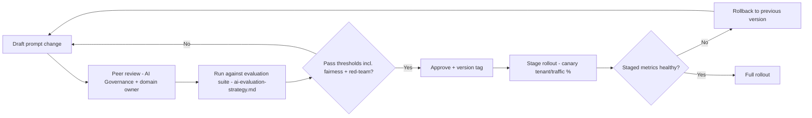

# Prompt Management

> Title: Prompt Management | Version: 1.0 | Owner: [TENANT_CONFIGURATION_REQUIRED — AI Governance Lead] | Status: Draft | Last reviewed: 2026-09-07 | Next review: [TENANT_CONFIGURATION_REQUIRED] | Reviewers: AI Governance, Security

## Purpose and scope

Defines lifecycle management for system prompts stored under `prompts/system/`, `prompts/skills/`, `prompts/evaluation/`, and `prompts/red-team/`.

## Prompt versioning

Every prompt file has a version tag recorded in the `prompt_version` table ([data-dictionary.md](../03-data/data-dictionary.md)) and referenced by `match_score.prompt_version_id` and equivalent fields elsewhere, so every AI output is traceable to the exact prompt that produced it.

## Lifecycle

## Ownership and approval

Each prompt file has a designated owner (skill owner) and requires AI Governance Lead sign-off before promotion to production, recorded as `approved_by`/`approved_at` on the `prompt_version` record.

## Testing requirements before promotion

- Functional evaluation against the relevant dataset in `evals/datasets/` and `evals/cases/` (see [ai-evaluation-strategy.md](ai-evaluation-strategy.md)).
- Fairness check for any prompt touching candidate matching (see [fairness-and-bias-governance.md](../05-security-governance/fairness-and-bias-governance.md)).
- Red-team pass for any prompt processing untrusted content (see [red-team-plan.md](red-team-plan.md)).

## Rollback

Rollback is a configuration change (pointing the skill's active `prompt_version_id` back to the prior version), not a code deploy — enabling fast recovery from a regression. Rollback events are logged and trigger a mandatory post-incident note if the regression reached production traffic.

## Change control

| Version | Date | Author | Change |
|---|---|---|---|
| 1.0 | 2026-09-07 | Documentation package generation | Initial creation |
