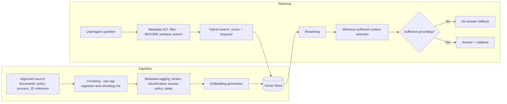

# RAG Architecture

> Title: RAG Architecture | Version: 1.0 | Owner: [TENANT_CONFIGURATION_REQUIRED — AI Governance Lead] | Status: Draft | Last reviewed: 2026-09-07 | Next review: [TENANT_CONFIGURATION_REQUIRED] | Reviewers: Architecture, Security, AI Governance

## Purpose and scope

Details the RAG architecture within the boundary set by [ADR-003](../adr/ADR-003-rag-and-vector-store-boundary.md): approved retrieval content only, never a system of record.

## Architecture

## Key design rules

1. **Metadata ACL filtering happens before similarity search**, not after — a document a user/tenant is not entitled to see is never scored or returned, even partially (see [retrieval-and-grounding-policy.md](retrieval-and-grounding-policy.md)).
2. Never index raw candidate identity documents or confidential interview feedback by default (see [ADR-003](../adr/ADR-003-rag-and-vector-store-boundary.md), [privacy-and-pii-handling.md](../05-security-governance/privacy-and-pii-handling.md)).
3. Every answer must cite the specific chunks used; if sufficient grounding isn't found, the system returns a no-answer fallback rather than a hallucinated answer.
4. The vector store is fully rebuildable from `rag_document`/source content — treat the index as a derived cache, not a backup-critical store (see [resilience-and-disaster-recovery.md](../01-architecture/resilience-and-disaster-recovery.md)).

## Tenant isolation in retrieval

Each tenant's approved content is either stored in a tenant-scoped namespace/index, or in a shared index with mandatory tenant_id metadata filtering enforced server-side before any vector search executes — never left to client-supplied filters alone.

## Cross-references

[rag-ingestion-and-chunking.md](rag-ingestion-and-chunking.md) · [retrieval-and-grounding-policy.md](retrieval-and-grounding-policy.md) · [rag-config.schema.json](../../config/schemas/rag-config.schema.json) · [rag.default.yaml](../../config/defaults/rag.default.yaml)

## Change control

| Version | Date | Author | Change |
|---|---|---|---|
| 1.0 | 2026-09-07 | Documentation package generation | Initial creation |
