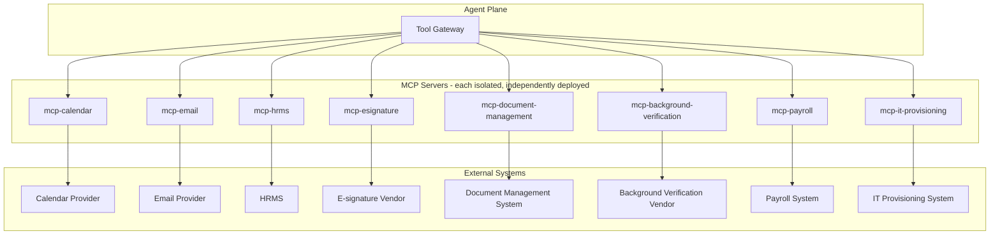

# MCP Architecture

> Title: MCP Architecture | Version: 1.0 | Owner: [TENANT_CONFIGURATION_REQUIRED — Integration Architecture] | Status: Draft | Last reviewed: 2026-09-07 | Next review: [TENANT_CONFIGURATION_REQUIRED] | Reviewers: Architecture, Security

## Purpose and scope

Details the MCP (Model Context Protocol) server topology implementing [ADR-004](../adr/ADR-004-mcp-security-model.md): one isolated, authenticated MCP server per external system domain.

## Topology

## Server catalog

| MCP server | Domain | Tool tiers offered | Vendor (configurable) |
|---|---|---|---|
| `mcp-calendar` | Interview scheduling | Read-only (availability), propose-only (draft invite) | [TENANT_CONFIGURATION_REQUIRED — M365/Google Workspace] |
| `mcp-email` | Notifications | Propose-only (draft), approval-required write (send) for candidate-facing sensitive emails | [TENANT_CONFIGURATION_REQUIRED] |
| `mcp-hrms` | Org reference data, employee creation | Read-only (reference data), approval-required write (employee record creation) | [TENANT_CONFIGURATION_REQUIRED] |
| `mcp-esignature` | Offer execution | Approval-required write (send for signature) | [TENANT_CONFIGURATION_REQUIRED] |
| `mcp-document-management` | External DMS (if used) | Read-only, propose-only | [TENANT_CONFIGURATION_REQUIRED] |
| `mcp-background-verification` | BGV initiation/results | Approval-required write (initiate check), read-only (results) | [TENANT_CONFIGURATION_REQUIRED] |
| `mcp-payroll` | New-hire feed | Approval-required write | [TENANT_CONFIGURATION_REQUIRED] |
| `mcp-it-provisioning` | Account/access requests | Approval-required write | [TENANT_CONFIGURATION_REQUIRED] |

## Isolation properties

Each server: its own deployment unit, its own credentials (scoped to only that external system), its own network egress allowlist, independent versioning/rollback, and independent circuit breaker. A compromise of one MCP server does not grant access to another (see [ADR-004](../adr/ADR-004-mcp-security-model.md)).

## Cross-references

[mcp-security-and-authorization.md](mcp-security-and-authorization.md) · [mcp-tool-governance.md](mcp-tool-governance.md) · [integration-adapter-catalog.md](integration-adapter-catalog.md) · [mcp/servers/README.md](../../mcp/servers/README.md) · [mcp/tool-schemas/hr-tools.schema.json](../../mcp/tool-schemas/hr-tools.schema.json)

## Change control

| Version | Date | Author | Change |
|---|---|---|---|
| 1.0 | 2026-09-07 | Documentation package generation | Initial creation |
