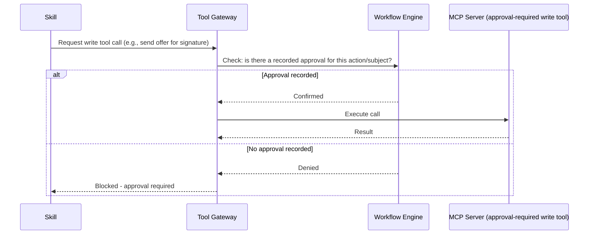

# MCP Security and Authorization

> Title: MCP Security and Authorization | Version: 1.0 | Owner: [TENANT_CONFIGURATION_REQUIRED — Security Architecture] | Status: Draft | Last reviewed: 2026-09-07 | Next review: [TENANT_CONFIGURATION_REQUIRED] | Reviewers: Security, Architecture

## Purpose and scope

Defines authentication, authorization, and safety controls for every MCP server in [mcp-architecture.md](mcp-architecture.md).

## Authentication

- OAuth 2.1 / OIDC client-credentials flow between the Tool Gateway and each MCP server; short-lived access tokens (default 10 minutes — [TENANT_CONFIGURATION_REQUIRED]).
- Each MCP server authenticates to its external vendor using its own credential, sourced from the vault (see [secrets-and-key-management.md](../05-security-governance/secrets-and-key-management.md)) — never a credential shared across servers.
- No long-lived static API keys held by the agent runtime itself.

## Tool tiers and authorization

| Tier | Definition | Authorization requirement |
|---|---|---|
| Read-only | Query external data, no side effects | Skill-level scope grant only |
| Propose-only | Produces a draft/suggestion, no external side effect until a separate confirmation step | Skill-level scope grant only |
| Approval-required write | Performs a real side effect on a sensitive external system (send offer for signature, create HRMS record, send candidate email) | Skill-level scope grant **and** the Workflow Engine must confirm a recorded human approval exists for the corresponding workflow action before the Tool Gateway permits the call |

## Input validation and output sanitization

- Every tool call's input is validated against the tool's JSON Schema (`mcp/tool-schemas/hr-tools.schema.json`) before dispatch.
- Every tool response is treated as untrusted content (see [prompt-injection-defense.md](../05-security-governance/prompt-injection-defense.md)) and sanitized before being passed back into any subsequent model context.

## Network and egress control

Each MCP server has an explicit network egress allowlist limited to its specific vendor endpoint(s); no MCP server has general internet egress.

## Reliability controls

Timeouts, retries with backoff, and circuit breakers are applied per MCP server independently (see [resilience-and-disaster-recovery.md](../01-architecture/resilience-and-disaster-recovery.md)); a failure in one server does not cascade to others.

## Audit logging

Every MCP tool invocation (request, scope used, outcome, latency) is logged to the audit trail (see [audit-log-specification.md](../03-data/audit-log-specification.md)), including denied calls (e.g., approval-required write attempted without a recorded approval).

## Human confirmation before sensitive writes

## Change control

| Version | Date | Author | Change |
|---|---|---|---|
| 1.0 | 2026-09-07 | Documentation package generation | Initial creation |
