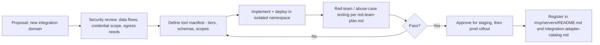

# MCP Tool Governance

> Title: MCP Tool Governance | Version: 1.0 | Owner: [TENANT_CONFIGURATION_REQUIRED — Integration Architecture / Security] | Status: Draft | Last reviewed: 2026-09-07 | Next review: [TENANT_CONFIGURATION_REQUIRED] | Reviewers: Architecture, Security, AI Governance

## Purpose and scope

Defines the lifecycle for adding, versioning, and retiring MCP tools/servers, and the onboarding/offboarding/security-review process referenced by [mcp-architecture.md](mcp-architecture.md).

## Tool manifest and versioning

Every MCP server publishes a versioned tool manifest (schema: [hr-tools.schema.json](../../mcp/tool-schemas/hr-tools.schema.json)) declaring: tool name, tier (read-only/propose-only/approval-required write), input/output schema, required scopes, and rate limits. Manifest changes are versioned; the Tool Gateway pins to a specific manifest version per environment and only upgrades after review.

## Onboarding process for a new MCP server

## Offboarding process

1. Confirm no active skill references the server's tools (dependency check against `agent-skill-catalog.md`).
2. Revoke credentials and remove network egress allowlist entries.
3. Retain audit logs per [data-classification-and-retention.md](../03-data/data-classification-and-retention.md) retention rules (audit logs outlive the integration itself).
4. Remove from the tool manifest registry and update documentation.

## Change governance for existing tools

| Change type | Approval required |
|---|---|
| Add a new read-only tool | Architecture review |
| Add a new propose-only tool | Architecture + AI Governance review |
| Add or modify an approval-required write tool | Architecture + Security + AI Governance review (this is the highest-risk category) |
| Change a tool's scope/permissions | Security review, re-run [security-test-plan.md](../05-security-governance/security-test-plan.md) tenant-isolation and authorization tests |
| Deprecate a tool | Follow [versioning-and-deprecation-policy.md](../04-api/versioning-and-deprecation-policy.md) pattern |

## Ongoing security review

Each MCP server undergoes a security review on a configurable cadence (default: annually — [TENANT_CONFIGURATION_REQUIRED]) or upon any credential/scope change, covering: credential scope minimality, egress allowlist accuracy, and manifest-to-implementation consistency.

## Change control

| Version | Date | Author | Change |
|---|---|---|---|
| 1.0 | 2026-09-07 | Documentation package generation | Initial creation |
