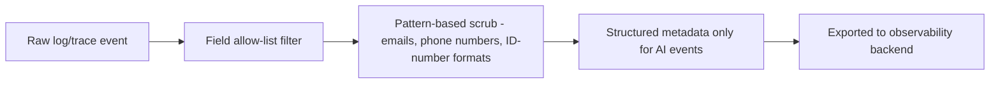

# Logging and Redaction Standard

> Title: Logging and Redaction Standard | Version: 1.0 | Owner: [TENANT_CONFIGURATION_REQUIRED — Security Architecture] | Status: Draft | Last reviewed: 2026-09-07 | Next review: [TENANT_CONFIGURATION_REQUIRED] | Reviewers: Security, Privacy, DevOps

## Purpose and scope

Defines the mandatory redaction pipeline that every log/trace/metric passes through before leaving a service boundary, implementing the non-negotiable rule in Section 4 of [CLAUDE.md](../../CLAUDE.md): never log PII, secrets, raw documents, or full prompts by default.

## Redaction rules

| Data category | Logging rule |
|---|---|
| Candidate/employee PII (name, email, phone, ID numbers) | Never logged in plain text; reference by entity ID only |
| Documents/CVs (raw content) | Never logged; reference by `blob_ref`/document ID only |
| Compensation figures | Never logged |
| Confidential interview feedback text | Never logged; reference by `interview_feedback.id` only |
| Full LLM prompts/responses | Never logged by default; only structured metadata (model, prompt version, token counts, guardrail outcome) is logged — see [observability-strategy.md](observability-strategy.md) |
| Secrets/tokens | Never logged, even partially/truncated |
| Correlation/entity IDs | Always logged (not PII, needed for tracing) |

## Redaction pipeline

## Opt-in debug capture

A tightly scoped, role-gated, time-limited debug mode may capture additional detail (e.g., a redacted prompt snippet) for active incident investigation only, requiring `compliance_reviewer` or `security` role to enable, auto-expiring after a configurable window, and itself logged as a sensitive action (see [audit-log-specification.md](../03-data/audit-log-specification.md)).

## Enforcement

Redaction is implemented as a shared logging middleware/library used by every service — not left to individual developers to remember per call site. New log statements are reviewed for compliance with this standard as part of code review (see [.claude/rules/security.md](../../.claude/rules/security.md)).

## Change control

| Version | Date | Author | Change |
|---|---|---|---|
| 1.0 | 2026-09-07 | Documentation package generation | Initial creation |
