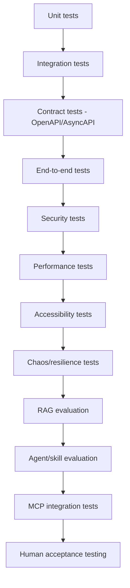

# Test Strategy

> Title: Test Strategy | Version: 1.0 | Owner: [TENANT_CONFIGURATION_REQUIRED — QA Lead] | Status: Draft | Last reviewed: 2026-09-07 | Next review: [TENANT_CONFIGURATION_REQUIRED] | Reviewers: QA, Architecture, Security, AI Governance

## Purpose and scope

Defines the full test pyramid for the platform, integrating functional, security, performance, accessibility, and AI-specific testing tiers.

## Test pyramid

## Tier definitions

| Tier | Scope | Owner | Cadence |
|---|---|---|---|
| Unit | Individual functions/classes, domain invariants (e.g., illegal state transitions rejected) | Engineering | Every commit |
| Integration | Service-to-DB, service-to-service within a bounded context | Engineering | Every PR |
| Contract | Requests/responses conform to [hr-onboarding-api.openapi.yaml](../../openapi/hr-onboarding-api.openapi.yaml) / [hr-onboarding-events.asyncapi.yaml](../../asyncapi/hr-onboarding-events.asyncapi.yaml) | Engineering | Every PR |
| End-to-end | Full workflow paths (see [test-case-catalog.md](test-case-catalog.md)) | QA | Every release candidate |
| Security | Per [security-test-plan.md](../05-security-governance/security-test-plan.md) | Security | Every PR (SAST/SCA) + every release (DAST/pen-test cadence) |
| Performance | Load/latency against [non-functional-requirements.md](../01-architecture/non-functional-requirements.md) targets | Performance Engineering | Every release, plus scheduled load tests |
| Accessibility | WCAG target conformance | QA/Frontend | Every UI-affecting release |
| Chaos/resilience | Fault injection per [resilience-and-disaster-recovery.md](../01-architecture/resilience-and-disaster-recovery.md) | SRE | Scheduled cadence in staging |
| RAG evaluation | Groundedness, citation validity, no-answer calibration | AI Governance | Every prompt/model/RAG-config change |
| Agent/skill evaluation | Functional accuracy, fairness, per [ai-evaluation-strategy.md](../06-ai-agents-rag/ai-evaluation-strategy.md) | AI Governance | Every prompt/model change |
| MCP integration | Tool schema conformance, approval-gating enforcement, circuit breaker behavior | Integration Engineering | Every PR touching adapters/MCP |
| Human acceptance | Business stakeholder sign-off against [acceptance-criteria.md](acceptance-criteria.md) | Product/HR | Every release |

## Test data policy

All test data is fake/demo — never real candidate/employee data (Section 7, CLAUDE.md). Synthetic data generation for volume/load testing must not be derived from de-anonymized production data.

## Change control

| Version | Date | Author | Change |
|---|---|---|---|
| 1.0 | 2026-09-07 | Documentation package generation | Initial creation |
