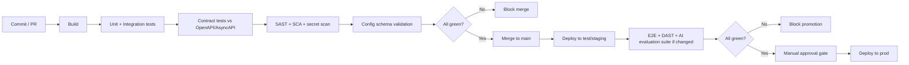

# CI/CD Quality Gates

> Title: CI/CD Quality Gates | Version: 1.0 | Owner: [TENANT_CONFIGURATION_REQUIRED — DevOps] | Status: Draft | Last reviewed: 2026-09-07 | Next review: [TENANT_CONFIGURATION_REQUIRED] | Reviewers: DevOps, Security, QA

## Purpose and scope

Defines mandatory gates in the CI/CD pipeline (provider configurable — see [technology-selection-matrix.md](../01-architecture/technology-selection-matrix.md)) before code/config reaches each environment in [environment-strategy.md](environment-strategy.md).

## Gate sequence

## Mandatory gates

| Gate | Blocks merge/deploy on |
|---|---|
| Build | Any compile/build failure |
| Unit + integration tests | Any failing test |
| Contract tests | Any OpenAPI/AsyncAPI schema mismatch |
| SAST/SCA/secret scan | Any Critical/High finding (see [security-test-plan.md](../05-security-governance/security-test-plan.md)) |
| Config schema validation | Any `config/` file failing its JSON Schema |
| E2E tests | Any failing end-to-end scenario ([test-case-catalog.md](../09-quality-evaluation/test-case-catalog.md)) |
| DAST | Any Critical/High finding on staging |
| AI evaluation suite | Any metric below release threshold when prompt/model/RAG config changed ([ai-evaluation-strategy.md](../06-ai-agents-rag/ai-evaluation-strategy.md)) |
| Manual approval to prod | Missing sign-off per [environment-strategy.md](environment-strategy.md) |

## No bypass policy

No gate is skipped via `--no-verify`-equivalent shortcuts except in a declared, logged emergency-fix process requiring post-hoc review — never as routine practice (see [.claude/rules/testing.md](../../.claude/rules/testing.md)).

## Change control

| Version | Date | Author | Change |
|---|---|---|---|
| 1.0 | 2026-09-07 | Documentation package generation | Initial creation |
