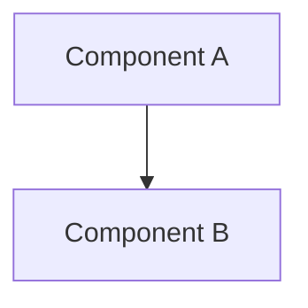

# [Architecture Document Title]

> Title: [Title] | Version: 0.1 | Owner: [TENANT_CONFIGURATION_REQUIRED] | Status: Draft | Last reviewed: [YYYY-MM-DD] | Next review: [TENANT_CONFIGURATION_REQUIRED] | Reviewers: Architecture, Security

## Purpose and scope

What this architecture covers, and what it explicitly excludes.

## Context diagram

## Bounded contexts / component responsibilities

| Component | Responsibility | Owns data | Talks to |
|---|---|---|---|
| | | | |

## Sync vs. async decisions

| Interaction | Style | Rationale |
|---|---|---|
| | | |

## Resilience patterns applied

Idempotency, optimistic concurrency, outbox, retry, circuit breaker, DLQ — which apply here and how.

## Non-functional considerations

Availability, latency, scalability, cost, security implications specific to this component.

## Assumptions and dependencies

## Risks and open questions

## Related ADRs

## Change control

| Version | Date | Author | Change |
|---|---|---|---|
| 0.1 | [YYYY-MM-DD] | [author] | Initial draft |
