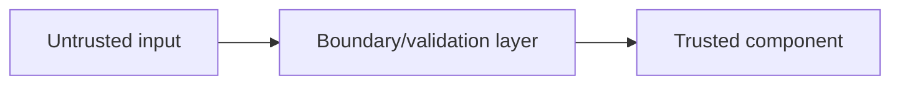

# Threat Model: [Component/Feature Name]

> Title: Threat Model — [Component] | Version: 0.1 | Owner: [TENANT_CONFIGURATION_REQUIRED] | Status: Draft | Last reviewed: [YYYY-MM-DD] | Reviewers: Security, Architecture

## Scope

What component/feature/data flow is being analyzed?

## Trust boundaries

## STRIDE analysis

| Category | Threat | Affected component | Mitigation | Residual risk |
|---|---|---|---|---|
| Spoofing | | | | |
| Tampering | | | | |
| Repudiation | | | | |
| Information disclosure | | | | |
| Denial of service | | | | |
| Elevation of privilege | | | | |

## AI/agent-specific abuse cases (if applicable)

| Abuse case | Mitigation |
|---|---|
| | |

## Residual risk acceptance

Who accepted which residual risk, and when.

## Change control

| Version | Date | Author | Change |
|---|---|---|---|
| 0.1 | [YYYY-MM-DD] | [author] | Initial draft |
