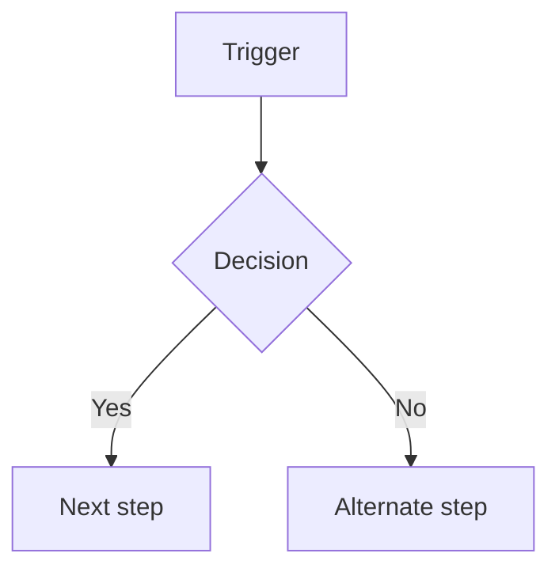

# [Workflow Name]

> Title: [Workflow Name] | Version: 0.1 | Owner: [TENANT_CONFIGURATION_REQUIRED] | Status: Draft | Last reviewed: [YYYY-MM-DD] | Reviewers: HR, Product, Architecture

## Purpose and scope

What business process does this workflow cover?

## Actors

Who/what participates (roles, systems, AI agents)?

## Workflow diagram

## Stage-by-stage detail

| # | Stage | Trigger | Primary actor | AI role | Human gate |
|---|---|---|---|---|---|
| | | | | | |

## Allowed and forbidden transitions

| From | To | Allowed if | Forbidden without |
|---|---|---|---|
| | | | |

## Configurable elements

Which stages, thresholds, or templates in this workflow are tenant-configurable, and where (`config/schemas/...`)?

## Change control

| Version | Date | Author | Change |
|---|---|---|---|
| 0.1 | [YYYY-MM-DD] | [author] | Initial draft |
